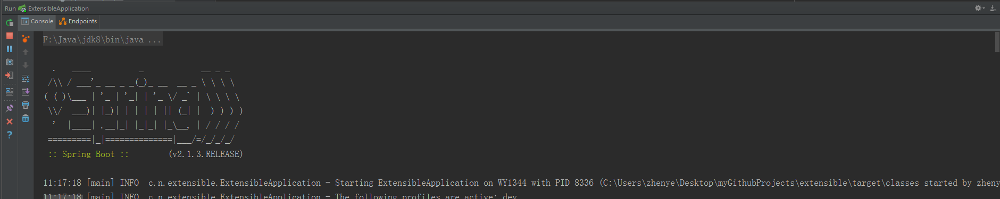
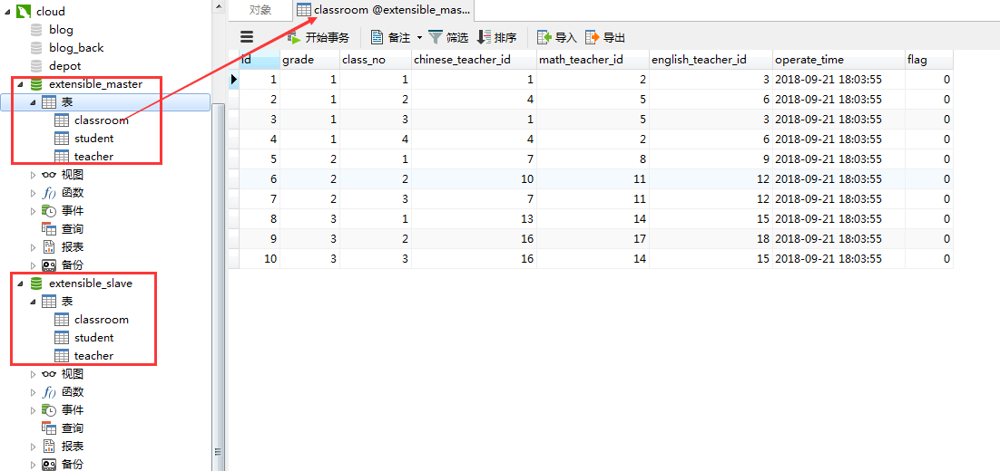
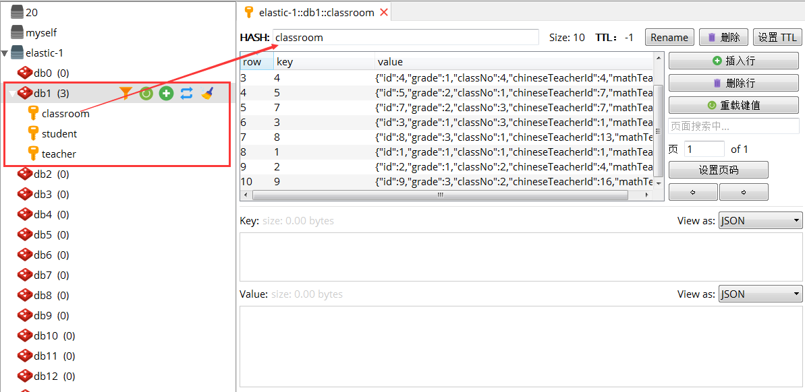
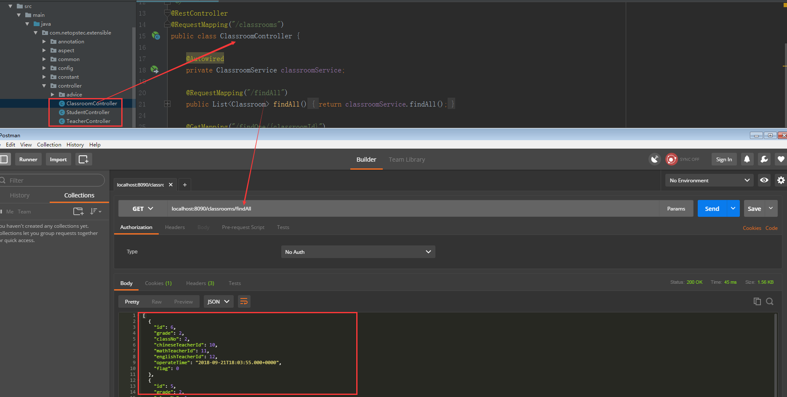
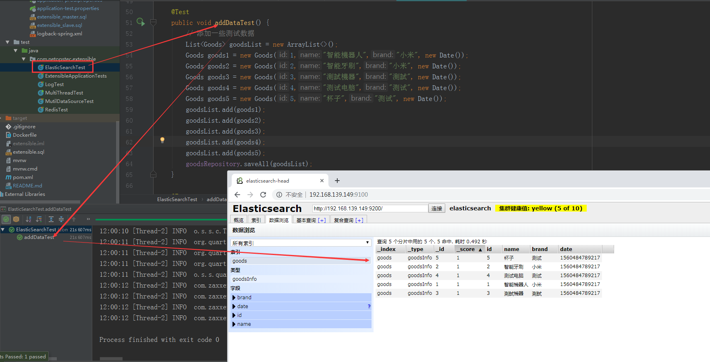
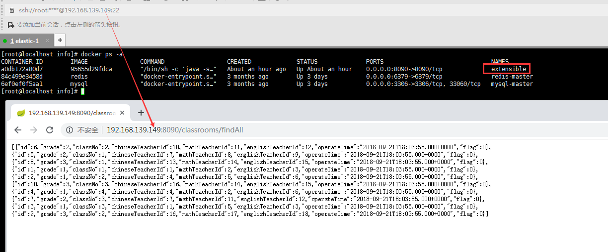

# extensible
这是一个java web项目。后期会加上一些中间件的应用。
# readme
每次更新，会在readme文件夹中上传本次更新对应技术要点的博客。
# 目前技术栈
Spring + Springboot + Springmvc + Mybatis + Docker + lombok + logback + quartz + rabbitmq + elasticsearch

# 项目启动说明

基础环境要求：`mysql-5.6` + `java-8`

1. 将项目克隆到本地

```bash
git clone https://github.com/zhenye163/extensible
```

2. 加载初始数据

执行`resources/extensible_master.sql`和`resources/extensible_slave.sql`的SQL文件，加载测试接口用的初始数据。

3. 以docker的方式安装redis

首先在虚拟机上安装docker---docker安装教程可参考[我的博客---dockerfile发布java-web项目](https://blog.csdn.net/UtopiaOfArtoria/article/details/82150811)。安装成功后，拉取redis镜像并启动对应的redis-master容器。

```bash
docker pull redis
docker run -d --name redis-master -p 6379:6379 redis
```

通过`ifconfig`命令获取虚拟机的ip地址，并修改配置文件`resources/application-dev.properties`的 `spring.redis.host`属性为提供redis服务的虚拟机的ip地址。

4. 由于还未配置`elasticsearch`环境，需要将当前项目中与`elasticsearch`相关的代码注释掉。

> 要注释的代码有：`resources/application-dev.properties`配置文件中与`elasticsearch`相关代码；`com.netopstec.extensible.elasticsearch`下的所有文件；`ElasticSearchTest`测试文件即可。

5. 执行`mvn springboot:run`命令或在开发工具帮助下，启动项目。

出现如下图所示，则成功启动本地项目。



`runner.ApplicationRunner`定义了一个项目初始化任务。项目启动时，会将mysql中的数据全部同步到redis中。项目成功启动后，可以在可视化工具`navcat`中查看mysql的数据，在可视化工具`redis-deskop-manager`中查看redis的数据。

mysql中的数据如下：



redis中的数据如下：



可以在`postman`中测试接口是否走通，测试效果图如下：



6. 项目中简单测试了一下消息队列`rabbitmq`的功能，其安装教程和相关代码测试可参考我的博客---[简单了解rabbitmq](https://blog.csdn.net/UtopiaOfArtoria/article/details/82981979)

7. 项目中还整合了全文检索功能---`ElasticSearch`，其安装教程和相关测试代码可参考我的博客---[ElasticSearch全家桶](https://blog.csdn.net/UtopiaOfArtoria/article/details/88403459)。安装`ElasticSearch`后放开相关代码，即可在项目中测试。成功安装后的测试效果如下：



8. 如果需要虚拟机的docker容器中部署当前web项目，可参考我的博客---[dockerfile发布java-web项目](https://blog.csdn.net/UtopiaOfArtoria/article/details/82150811)。部署成功后，放开防火墙或仅仅打开虚拟机的8090端口，即可在浏览器中测试项目是否部署成功。部署成功后的测试效果图如下：



9. 后续我会根据自身代码水平，不断更新并完善这个java-web后端项目。如果觉得有用，麻烦star。如果觉得项目有问题的话，可以在issues中提问和以邮件的方式告知。

# 项目文档汇总
1. 搭建一个基于SSM的java-web项目，具体的实现细节可参考[搭建java-web项目](https://github.com/zhenye163/extensible/blob/master/readme/readme-1/%E6%90%AD%E5%BB%BA%E4%B8%80%E4%B8%AA%E5%9F%BA%E4%BA%8ESSM%E6%A1%86%E6%9E%B6%E7%9A%84java-web%E9%A1%B9%E7%9B%AE.md)
2. 将该web项目发布到CentOS-7的Docker容器中，具体的实现细节可参考[dockerfile发布web项目](https://github.com/zhenye163/extensible/blob/master/readme/readme-2/%E4%BB%A5dockerfile%E7%9A%84%E6%96%B9%E5%BC%8F%E5%8F%91%E5%B8%83java-web%E9%A1%B9%E7%9B%AE.md)
3. 将该web项目按日志的级别进行分层管理（slf4j + logback），具体的实现细节可参考[日志分层实现](https://github.com/zhenye163/extensible/blob/master/readme/readme-3/(slf4j%20%2B%20logback)%E8%BF%9B%E8%A1%8C%E6%97%A5%E5%BF%97%E5%88%86%E5%B1%82.md)
4. 学习几种常见的加密算法，具体的实现细节可参考[常见的加密算法](https://github.com/zhenye163/extensible/blob/master/readme/readme-4/java-web%E5%BC%80%E5%8F%91%E4%B8%AD%E5%B8%B8%E8%A7%81%E5%8A%A0%E5%AF%86%E7%AE%97%E6%B3%95%E7%9A%84%E6%B1%87%E6%80%BB.md)
5. SpringBoot整合Redis，具体的实现细节可参考[SpringBoot整合Redis](https://github.com/zhenye163/extensible/blob/master/readme/readme-5/Redis%E5%A4%A7%E5%90%88%E9%9B%86.md)
6. SpringBoot + Mybatis进行多数据源的配置，具体的实现细节可参考[Mybatis多数据源配置](https://github.com/zhenye163/extensible/blob/master/readme/readme-6/Mybatis%E9%85%8D%E7%BD%AE%E5%A4%9A%E6%95%B0%E6%8D%AE%E6%BA%90.md)
7. SpringBoot整合Quartz实现多定时任务，具体的实现细节可参考[SpringBoot整合Quartz实现多定时任务](https://github.com/zhenye163/extensible/blob/master/readme/readme-7/SpringBoot%E6%95%B4%E5%90%88Quartz%E5%AE%9E%E7%8E%B0%E5%A4%9A%E5%AE%9A%E6%97%B6%E4%BB%BB%E5%8A%A1.md)
8. RabbitMQ在java-web中的简单应用，具体的实现细节可参考[RabbitMQ在java-web中的简单应用](https://github.com/zhenye163/extensible/blob/master/readme/readme-8/RabbitMQ%E5%9C%A8java-web%E4%B8%AD%E7%9A%84%E7%AE%80%E5%8D%95%E5%BA%94%E7%94%A8.md)
9. SpringBoot整合ElasticSearch，具体的实现细节可参考[SpringBoot整合ElasticSearch](https://github.com/zhenye163/extensible/blob/master/readme/readme-9/SpringBoot%E6%95%B4%E5%90%88ElasticSearch.md)