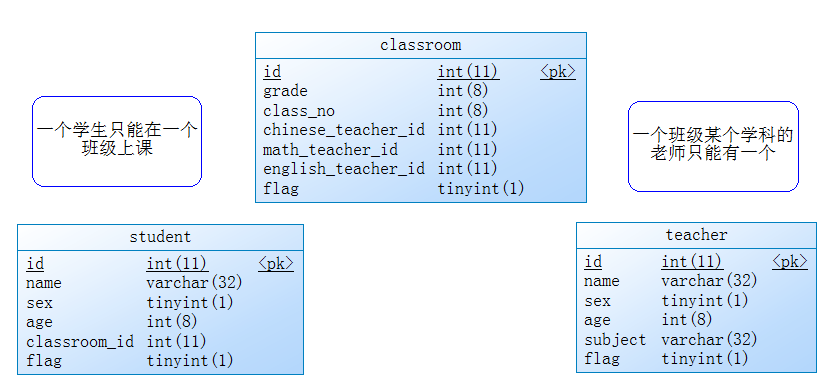
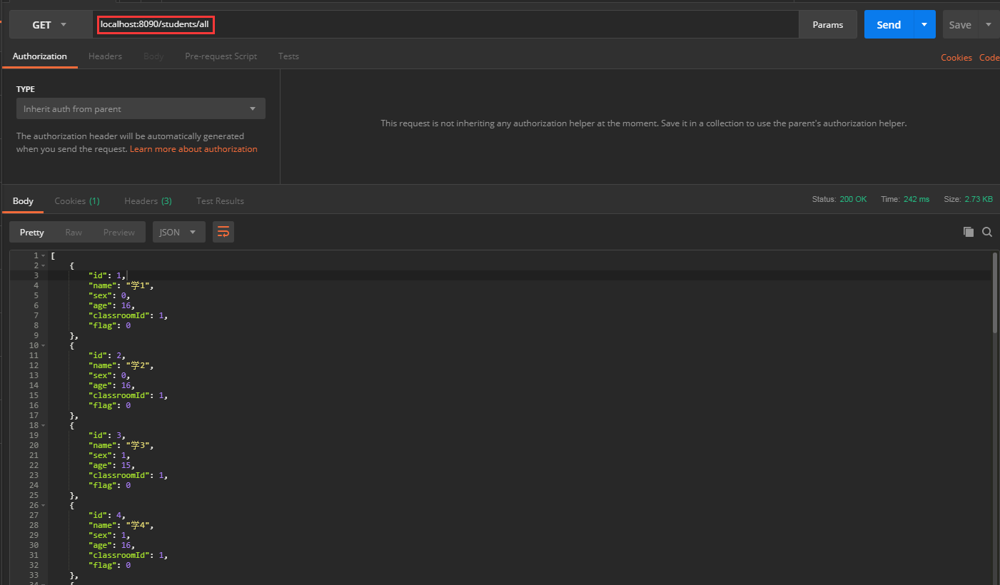

# extensible
这是一个基础的**java web**项目。后期我会根据自己的技术栈，在该项目中加上不同的功能模块。
# 项目详解

## 1.当前项目技术栈

Spring + SpringBoot + SpringMVC + JPA + lombok

## 2.当前项目实体关系图

> 基于实体关系图，进行数据库中的建表和项目的架构搭建，这里就不再赘述。

## 3.测试项目

> 建表语句即测试数据在extensible.sql里面。

启动项目，在Postman中测试如下图，说明基础项目应搭建完成。

