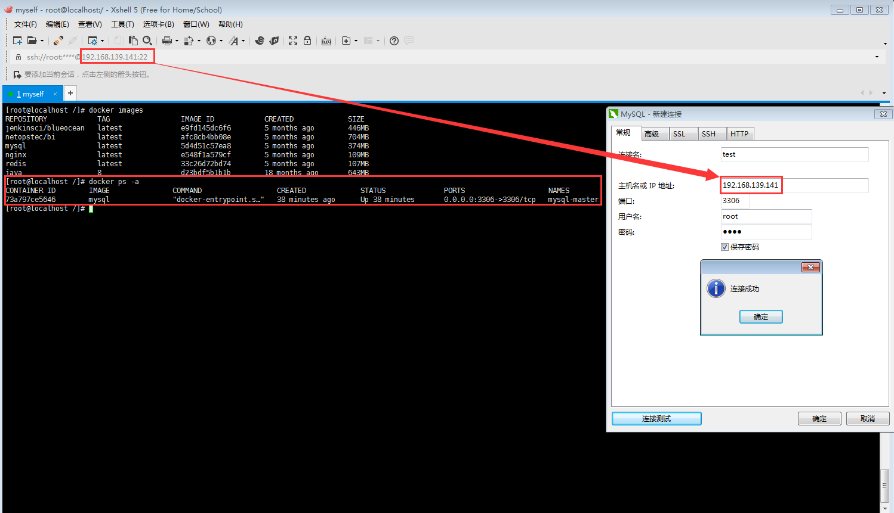
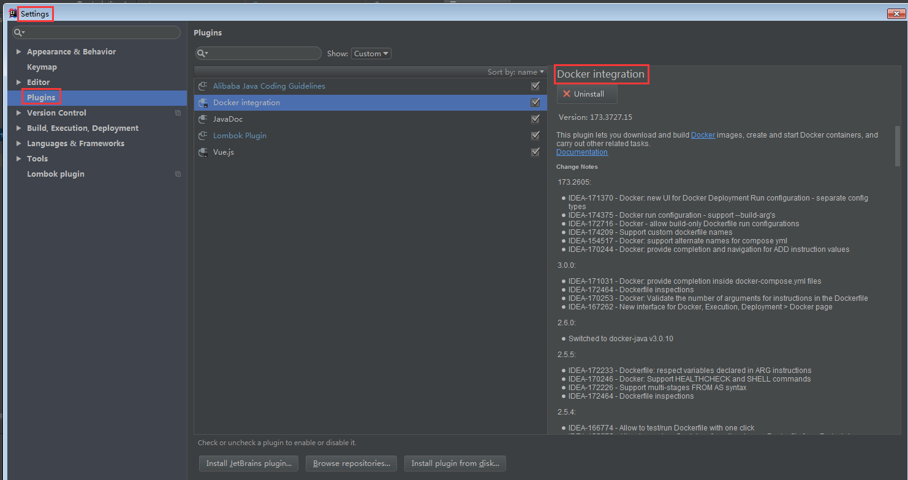
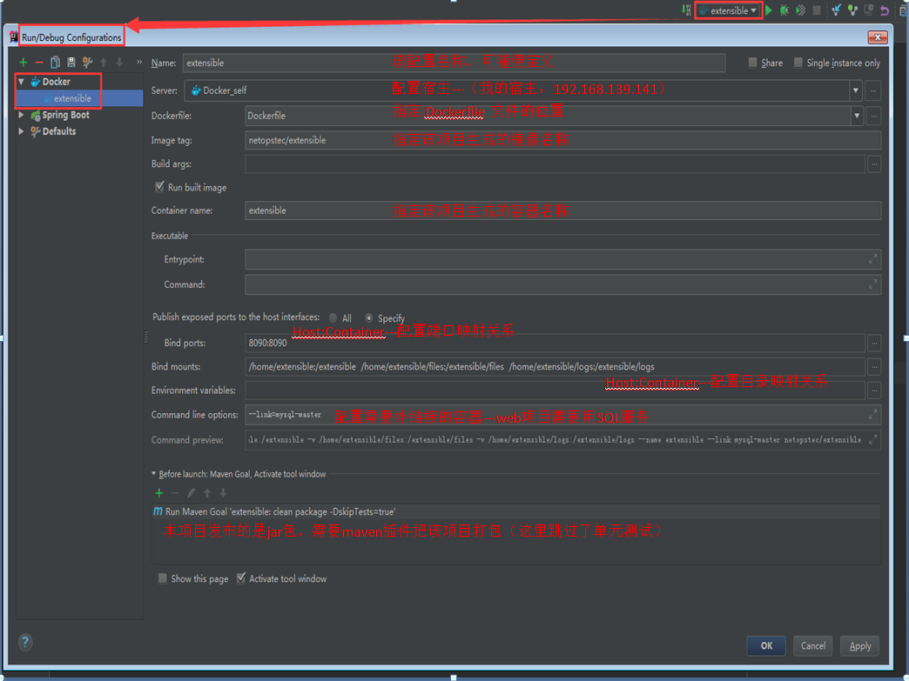
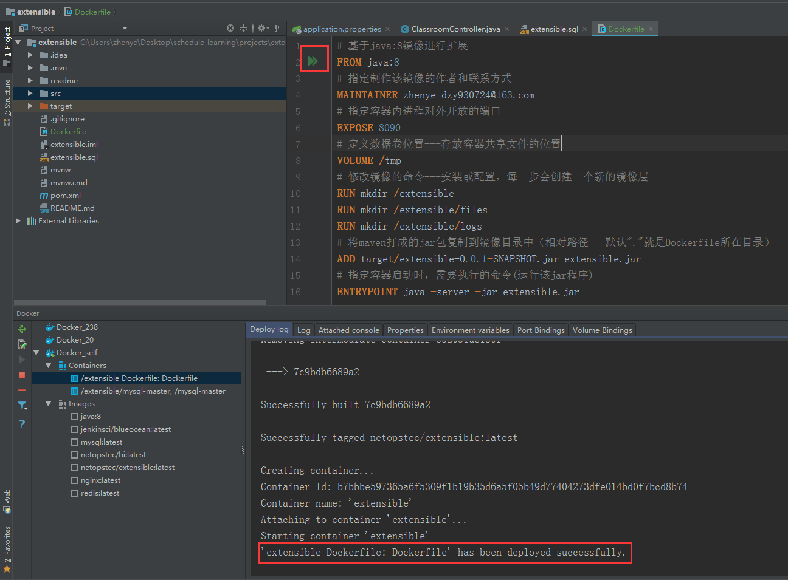
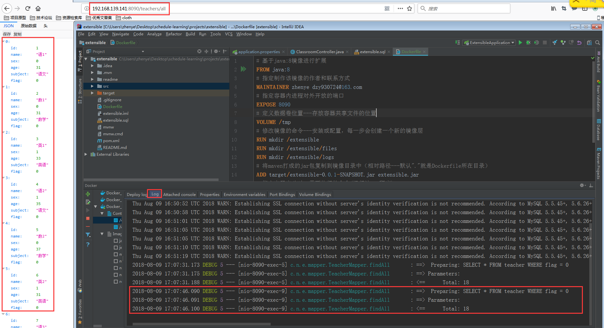
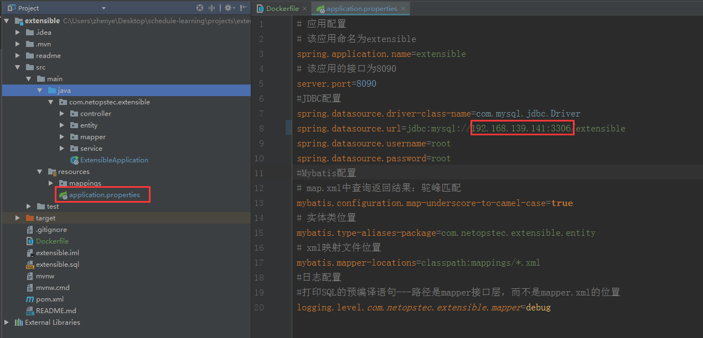

# extensible项目本次更新目的

以Dockerfile的方式，将该项目发布到CentOS-7的docker容器上。

# Docker相关环境搭建

## 1.空白虚拟机的“傻瓜式”安装

- 安装VMware Workstation
- 安装虚拟机(CentOS 7.4)

> 相关的平台及辅助工具和CentOS-7.4的镜像都在[我的百度网盘](https://pan.baidu.com/s/1S-F8GywpE-2VUHOzMMoEIQ)，提取码为**hksw**。安装过程非常简单，这里就不再赘述了。

## Docker相关

- 安装ce版docker

```bash
# 新增ifconfig功能
yum install net-tools.x86_64
# 保证yum是最新版本
yum update
# 安装wget工具
yum install wget
# 安装ce版docker
wget -P /etc/yum.repos.d/ https://download.docker.com/linux/centos/docker-ce.repo
yum install docker-ce
# 查看安装docker的版本
docker version
```

- 启动docker的远程访问服务

```bash
# 开启docker服务
systemctl start docker
# 开机自启docker服务
systemctl enable docker
# yum安装vim工具
yum install vim
# 将docker服务暴露在2375端口，需要编辑docker.service文件中[service]的ExecStart属性如下
vim /usr/lib/systemd/system/docker.service
ExecStart=/usr/bin/dockerd -H tcp://0.0.0.0:2375 -H unix://var/run/docker.sock
# 重载docker的配置，重启docker服务，就可以在本地电脑通过访问服务器2375端口，使用docker服务
systemctl daemon-reload
systemctl restart docker
```

- java-web项目的docker环境搭建

 ```bash
 # 拉取JDK8对应的docker环境（java:8）
 docker pull java:8
 # 拉取最新版本的mysql
docker pull mysql
# 基于mysql镜像，启动容器mysql-master，(host:docker)=(3306:3306),root账号密码为root
docker run --name mysql-master -p 3306:3306 -e MYSQL_ROOT_PASSWORD=root -d mysql

# 在命令行中通过如下命令可以测试是否能够使用mysql服务
# 进入mysql-master容器内部,可以使用mysql
docker exec -it mysql-master bash
# 登录---密码为root
mysql -u root -p
 ```
在navcat中测试联通，说明该java-web项目的docker环境搭建成功。
> 这里的192.168.139.141是该虚拟机的ip地址（实际情况，需要通过ifconfig命令获取对应的ip地址），3306是mysql服务对应在该虚拟机中的暴露端口。


在`test`连接中新建数据`extensible`,然后运行`extensible.sql`转储文件来填充测试数据，即该java-web项目的环境已经搭建成功。

# IDEA中通过DockerFile文件发布该web项目

1. 在IDEA中安装**Docker integration**的辅助插件



2. 在项目的根目录中新建Dockerfile文件如下：

```dockerfile
# 基于java:8镜像进行扩展
FROM java:8
# 指定制作该镜像的作者和联系方式
MAINTAINER zhenye dzy930724@163.com
# 指定容器内进程对外开放的端口
EXPOSE 8090
# 定义数据卷位置---存放容器共享文件的位置
VOLUME /tmp
# 修改镜像的命令---安装或配置，每一步会创建一个新的镜像层
RUN mkdir /extensible
RUN mkdir /extensible/files
RUN mkdir /extensible/logs
# 将maven打成的jar包复制到镜像目录中（相对路径---默认"."就是Dockerfile所在目录）
ADD target/extensible-0.0.1-SNAPSHOT.jar extensible.jar
# 指定容器启动时，需要执行的命令(运行该jar程序)
ENTRYPOINT java -server -jar extensible.jar
```

3. 编辑该extensible容器的配置参数如下：



# 测试项目是否成功发布

1. 出现如下图，则说明成功启动该容器



2. 在浏览器或Postman中输入相应的URL出现如下结果，则说明web项目正常运行。




# 趟过的坑总结：

1. 本地测试时，项目和Mysql是同一ip---(localhost即127.0.0.1)，但是在docker容器中用localhost是找不到相应的Mysql服务的。因此需要更改配置如下图：

