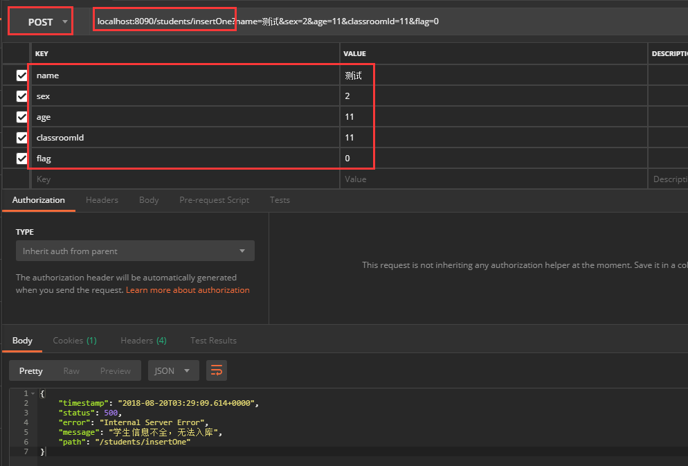
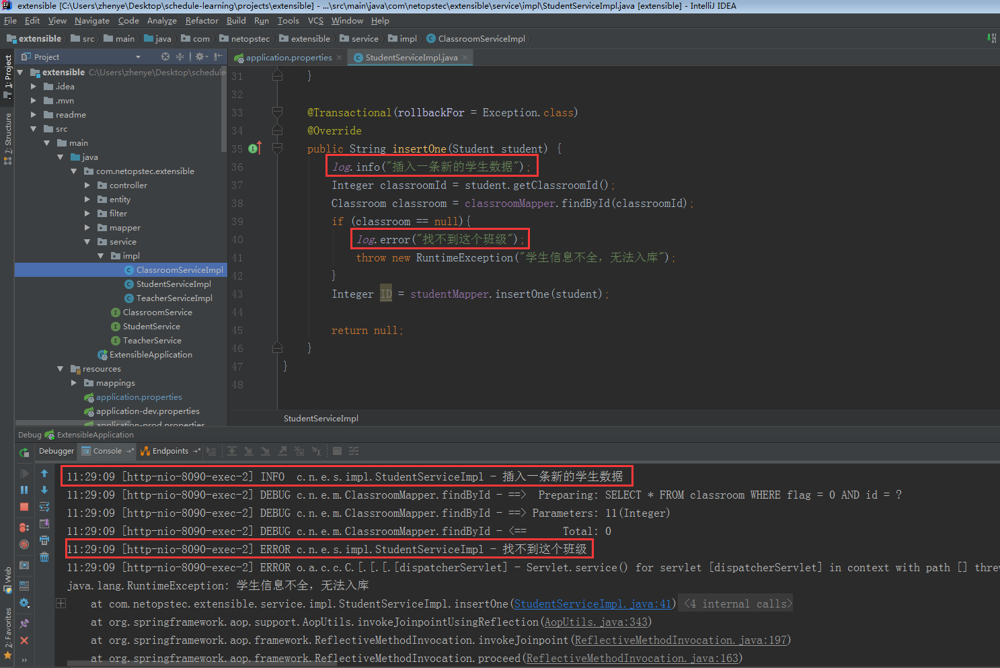
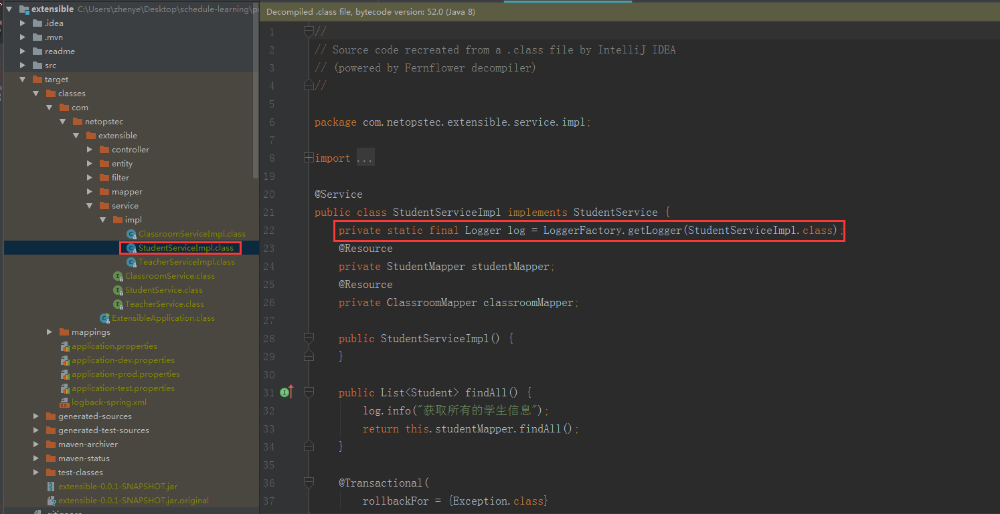
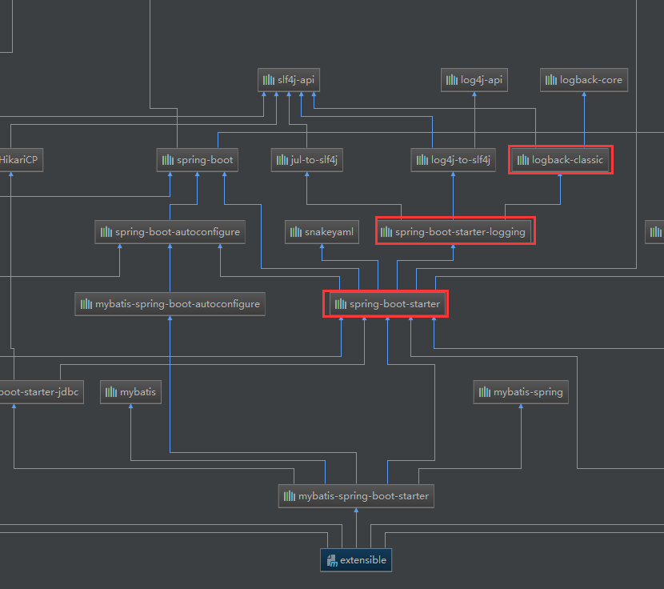
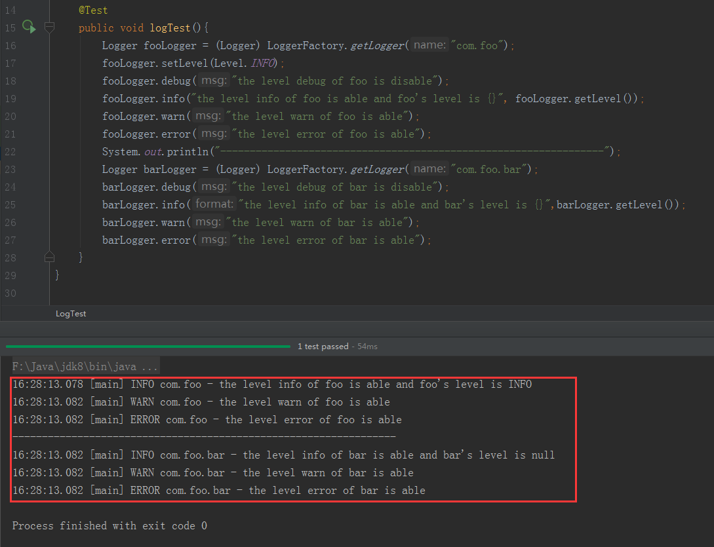
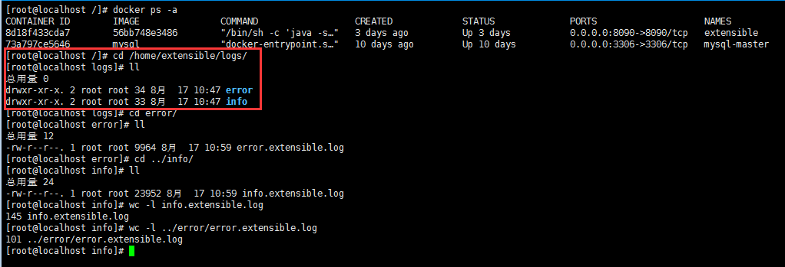

# slf4j和logback的概念

SLF4J，是`Simple Logging Facade for Java`的简称。简而言之，slf4j是一个日志门面，它只提供了通用的日志接口，而未提供日志功能的具体实现。</br>
log4j(log for java)以及logback框架都提供了日志的具体实现，而且SLF4J和log4j都是由一个开发人员Ceki完成，因此使用log4j进行日志实现的web项目，能够很好地切换为logback。
目前，slf4j + logback也是业内最流行的日志管理方式。

# 如何使用slf4j进行日志记录

详情参见**`com.netopstec.extensible.service.impl.StudentServiceImpl`**<br/>

```JAVA
/**
 * @author zhenye 2018/8/7
 */
@Service
@Slf4j
public class StudentServiceImpl implements StudentService{

    @Resource
    private StudentMapper studentMapper;
    @Resource
    private ClassroomMapper classroomMapper;

    @Override
    public List<Student> findAll() {
        log.info("获取所有的学生信息");
        return studentMapper.findAll();
    }

    @Transactional(rollbackFor = Exception.class)
    @Override
    public String insertOne(Student student) {
        log.info("插入一条新的学生数据");
        Integer classroomId = student.getClassroomId();
        Classroom classroom = classroomMapper.findById(classroomId);
        if (classroom == null){
            log.error("找不到这个班级");
            throw new RuntimeException("学生信息不全，无法入库");
        }
        Integer ID = studentMapper.insertOne(student);

        return null;
    }
}

```
在application.properties里面，设置`spring.profiles.active=dev`，修改为开发环境后，再启动项目。在postman中键入如下参数：

在控制台会出现如下日志：


这里我们是用注解`@Slf4j`的方式导入，然后使用了`info`和`error`两种级别分别进行日志的记录。我们探索一下`@Slf4j是如何帮助我们进行日志记录的。
> 在IDEA中通过快捷键(Ctrl + Alt + 鼠标左键)选中该注解，能够查看该注解的源码。

`@Sl4j`的源码如下：

```JAVA
package lombok.extern.slf4j;

@Retention(RetentionPolicy.SOURCE)
@Target({ElementType.TYPE})
public @interface Slf4j {
    String topic() default "";
}
```
这是lombok框架提供的一个源码级(SOURCE)类(TYPE)注解。也就是说，在编译时该注解已经实现了自己的功能。该注解的topic字段是自定义日志记录器的名称，默认就是该类的全限定名，这个可以自己测试。现在我们对比`StudentServiceImpl.class`与`StudentServiceImpl.java`，查看该注解到底帮我们做了些什么？



其实，就是多了一条语句：

```JAVA
public class StudentServiceImpl implements StudentService{
    private static final Logger log = LoggerFactory.getLogger(StudentServiceImpl.class);
}
```
也就是说，我们可以自己通过`LoggerFactory`获取到日志记录器。具体使用哪种方式，取决于自己的喜好。

# 走近logback



从extensible项目的maven依赖层级图可以看出：`logback-classic`是依赖于`slf4j-api`和`logback-core`。spring-boot-starter默认集成了logback的核心文件`logback-classic`。因此一个springboot项目，默认就是用logback进行日志的管理的。

Logback的具体实现是建立于三个主要类之上：`Logger`、`Appender`和`Layout`。这三种组件协同工作，使开发者可以按照消息类型和级别来记录消息，还可以在程序运行期内控制消息的输出格式和输出目的地。

## `Logger`

从注解`@Slf4j`的功能，我们可以看到：在`serviceImpl`类中关联一个`Logger`对象，我们才能使用该对象打印日志。然后`Logger`的部分源码如下：

```JAVA
package org.slf4j;

public interface Logger {
    String ROOT_LOGGER_NAME = "ROOT";
    boolean isTraceEnabled();
    void trace(String var1);
    boolean isDebugEnabled();
    void debug(String var1);
    boolean isInfoEnabled();
    void info(String var1);
    boolean isWarnEnabled();
    void warn(String var1);
    boolean isErrorEnabled();
    void error(String var1);
}
```
从源码我们可以看出：日志的有效级别有：`trace/debug/info/warn/error`（实际还有`all`和`off`级别，参见Level的源码）。然后Logger是分级别的，其根是ROOT。

> logger L的有效级别等于其层次等级里的第一个非null级别，顺序是从L开始，向上
直至根logger。为确保所有logger都能够最终继承一个级别，根logger总是有级别，默认情况下，这个级别是DEBUG。

测试的源码如下：

```JAVA
public class LogTest {
    @Test
    public void logTest(){
        Logger fooLogger = (Logger) LoggerFactory.getLogger("com.foo");
        fooLogger.setLevel(Level.INFO);
        fooLogger.debug("the level debug of foo is disable");
        fooLogger.info("the level info of foo is able and foo's level is {}", fooLogger.getLevel());
        fooLogger.warn("the level warn of foo is able");
        fooLogger.error("the level error of foo is able");
        System.out.println("-----------------------------------------------------------------");
        Logger barLogger = (Logger) LoggerFactory.getLogger("com.foo.bar");
        barLogger.debug("the level debug of bar is disable");
        barLogger.info("the level info of bar is able and bar's level is {}",barLogger.getLevel());
        barLogger.warn("the level warn of bar is able");
        barLogger.error("the level error of bar is able");
    }
}
```

测试结果如下：

## `Appender`和`Layout`

望文知意，`Appender`就是控制日志的输出位置：(控制台、文件、远程套接字服务器、MySQL、PostreSQL、Oracle和其他数据库、JMS和远程UNIX Syslog守护进程)。</br>
一个`Logger`可以关联多个`Appender`,他们可以通过`Logger.addAppender(Appender appender);`来添加关联关系。</br>
`Layout`就是控制日志的布局，我们可以通过如下方法进行布局自定义:

```JAVA
import ch.qos.logback.core.LayoutBase;
public class MySampleLayout extends LayoutBase<ILoggingEvent> {
    public String doLayout(ILoggingEvent event) {
        StringBuffer sbuf = new StringBuffer(128);
        sbuf.append(event.getTimeStamp()
        - event.getLoggerContextVO().getBirthTime());
        sbuf.append(" ");
        sbuf.append(event.getLevel());
        sbuf.append(" [");
        sbuf.append(event.getThreadName());
        sbuf.append("] ");
        sbuf.append(event.getLoggerName());
        sbuf.append(" - ");
        sbuf.append(event.getFormattedMessage());
        sbuf.append(CoreConstants.LINE_SEPARATOR);
        return sbuf.toString();
    }
}
```
# 用logback进行日志分层
（springboot项目）在resources目录下，新建logback-spring.xml，配置其内容如下：
```XML
<?xml version="1.0" encoding="UTF-8"?>
<configuration  scan="true" scanPeriod="60 seconds" debug="false">
    <springProfile name="dev">
        <!--输出到控制台-->
        <appender name="console" class="ch.qos.logback.core.ConsoleAppender">
            <encoder>
                <pattern>%d{HH:mm:ss} [%thread] %-5level %logger{36} - %msg%n</pattern>
            </encoder>
        </appender>
        <root level="info">
            <appender-ref ref="console" />
        </root>
    </springProfile>

    <springProfile name="prod,test">
        <!--ERROR级别的日志放在logErrorDir目录下，INFO级别的日志放在logInfoDir目录下-->
        <property name="logback.logErrorDir" value="/extensible/logs/error"/>
        <property name="logback.logInfoDir" value="/extensible/logs/info"/>
        <property name="logback.appName" value="extensible"/>
        <contextName>${logback.appName}</contextName>

        <!--ERROR级别的日志配置如下-->
        <appender name="fileErrorLog" class="ch.qos.logback.core.rolling.RollingFileAppender">
            <!--日志名称，如果没有File 属性，那么只会使用FileNamePattern的文件路径规则
                如果同时有<File>和<FileNamePattern>，那么当天日志是<File>，明天会自动把今天
                的日志改名为今天的日期。即，<File> 的日志都是当天的。
            -->
            <File>${logback.logErrorDir}/error.${logback.appName}.log</File>
            <!-- 日志level过滤器，保证error.***.log中只记录ERROR级别的日志-->
            <filter class="ch.qos.logback.classic.filter.LevelFilter">
                <level>ERROR</level>
                <onMatch>ACCEPT</onMatch>
                <onMismatch>DENY</onMismatch>
            </filter>
            <!--滚动策略，按照时间滚动 TimeBasedRollingPolicy-->
            <rollingPolicy class="ch.qos.logback.core.rolling.TimeBasedRollingPolicy">
                <!--文件路径,定义了日志的切分方式——把每一天的日志归档到一个文件中,以防止日志填满整个磁盘空间-->
                <FileNamePattern>${logback.logErrorDir}/error.${logback.appName}.%d{yyyy-MM-dd}.log</FileNamePattern>
                <!--只保留最近14天的日志-->
                <maxHistory>14</maxHistory>
                <!--用来指定日志文件的上限大小，那么到了这个值，就会删除旧的日志-->
                <!--<totalSizeCap>1GB</totalSizeCap>-->
            </rollingPolicy>
            <!--日志输出编码格式化-->
            <encoder>
                <charset>UTF-8</charset>
                <pattern>%d [%thread] %-5level %logger{36} %line - %msg%n</pattern>
            </encoder>
        </appender>

        <!--INFO级别的日志配置如下-->
        <appender name="fileInfoLog" class="ch.qos.logback.core.rolling.RollingFileAppender">
            <!--日志名称，如果没有File 属性，那么只会使用FileNamePattern的文件路径规则
                如果同时有<File>和<FileNamePattern>，那么当天日志是<File>，明天会自动把今天
                的日志改名为今天的日期。即，<File> 的日志都是当天的。
            -->
            <File>${logback.logInfoDir}/info.${logback.appName}.log</File>
            <!--自定义过滤器，保证info.***.log中只打印INFO级别的日志-->
            <filter class="com.netopstec.extensible.filter.InfoLevelFilter"/>
            <!--滚动策略，按照时间滚动 TimeBasedRollingPolicy-->
            <rollingPolicy class="ch.qos.logback.core.rolling.TimeBasedRollingPolicy">
                <!--文件路径,定义了日志的切分方式——把每一天的日志归档到一个文件中,以防止日志填满整个磁盘空间-->
                <FileNamePattern>${logback.logInfoDir}/info.${logback.appName}.%d{yyyy-MM-dd}.log</FileNamePattern>
                <!--只保留最近14天的日志-->
                <maxHistory>14</maxHistory>
                <!--用来指定日志文件的上限大小，那么到了这个值，就会删除旧的日志-->
                <!--<totalSizeCap>1GB</totalSizeCap>-->
            </rollingPolicy>
            <!--日志输出编码格式化-->
            <encoder>
                <charset>UTF-8</charset>
                <pattern>%d [%thread] %-5level %logger{36} %line - %msg%n</pattern>
            </encoder>
        </appender>
        <root level="info">
            <appender-ref ref="fileErrorLog" />
            <appender-ref ref="fileInfoLog"/>
        </root>
    </springProfile>
</configuration>
```
然后在(`com.netopstec.extensible.filter.InfoLevelFilter`)添加自定义过滤器

```JAVA
/**
 * 自定义过滤器，info.***.log中只打印INFO级别的日志
 * （如果不在配置文件中指定该过滤器，info.***.log或打印INFO以上所有级别的日志---root指定是INFO）
 * @author zhenye 2018/8/16
 */
public class InfoLevelFilter extends Filter<ILoggingEvent> {

    @Override
    public FilterReply decide(ILoggingEvent iLoggingEvent) {
        if (iLoggingEvent.getLevel().toInt() == Level.INFO.toInt()){
            return FilterReply.ACCEPT;
        }
        return FilterReply.DENY;
    }
}
```
在dockerfile文件中，添加两个建目录语句(`RUN mkdir /extensible/logs/error;RUN mkdir /extensible/logs/info`)，这两个目录用来存对应级别的日志。<br/>
发布成功后，进行多次测试，发现服务器日志如下图则说明日志分层成功。

