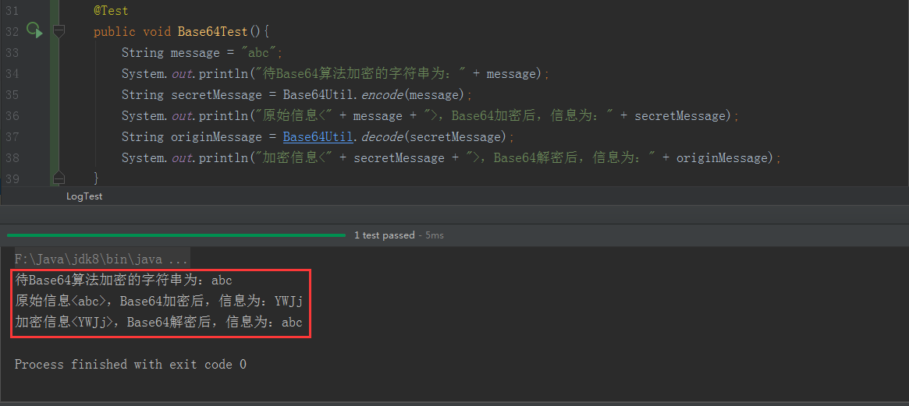
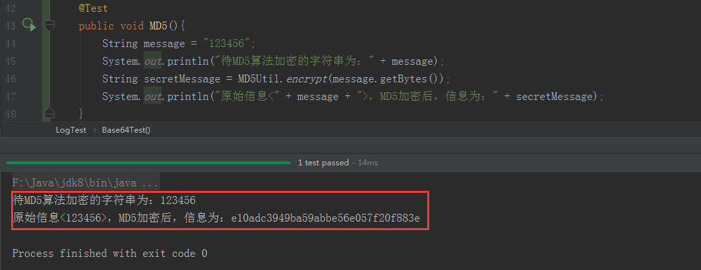
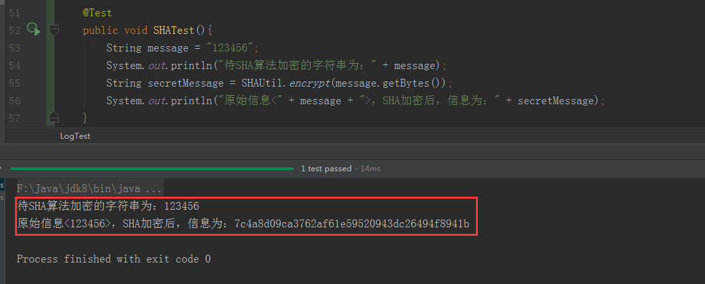
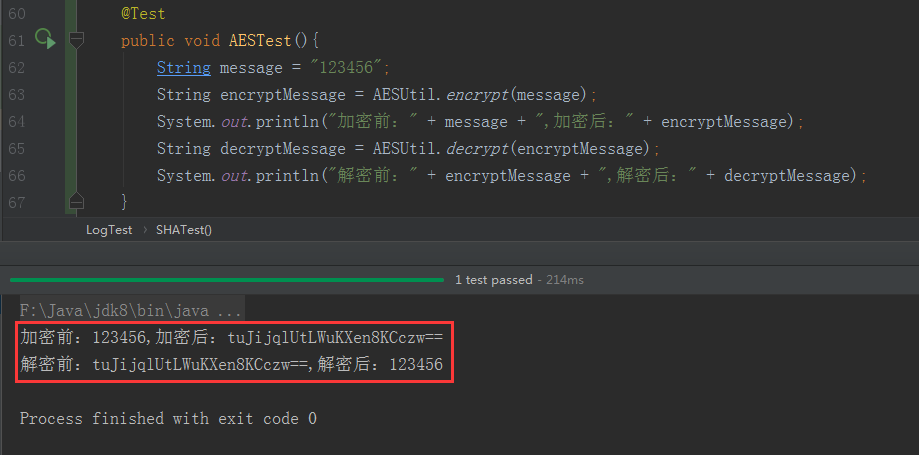
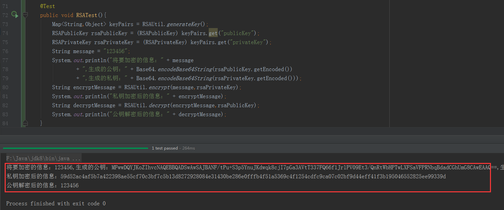

# 什么是加密算法？

百度百科给出的解释如下：

> 数据加密的基本过程就是对原来为明文的文件或数据按某种算法进行处理，使其成为不可读的一段代码，通常称为“密文”，使其只能在输入相应的密钥之后才能显示出本来内容，通过这样的途径来达到保护数据不被非法人窃取、阅读的目的。该过程的逆过程为解密，即将该编码信息转化为其原来数据的过程。

简单来说，就是把某一段数据（明文），按照“某种规则”转换成另外一段不可读的数据（密文）。这里选定的“规则”，就是加密算法。理所当然，当别人拿到“密文”，解析出“明文”的难度取决于加密算法的破解难度。

现在对在java-web的开发过程中经常会使用的加密算法汇总如下（都整理成工具类，在extensible项目的util包下）：

## Base64算法

### Base64算法工具类JAVA源码如下：

```JAVA
/**
 *  Base64是网络上最常见的用于传输8Bit字节代码的编码方式之一。
 *
 * @author zhenye 2018/8/22
 */
public class Base64Util {

    /*
        我们知道Java中是用"8个二进制数字"表示一个实际的字节。
        比如：我要用Base64编码一个字符串“abc”，实际算法如下：
        'a','b','c'的ASCII标准编码分别为（十进制）97,98,99,因此用二进制表示“abc”字符串就是：
        01100001，01100010，01100011           ---3组，每组8字节
        Base64的原理：将这三组8字节，分成4组6字节
        011000，010110， 001001，100011         ---4组，每组6字节
        高位补0
        00011000，00010110， 00001001，00100011
        这四个二进制数组对应十进制的数值分别是：24，22，9，35，RFC2045（Base64解码表）分别为：Y,W,J,j
        即："abc"经过Base64编码后，为"YWJj"。这个过程是可逆的。
        ---每次Base64编码都会扩容33%
     */

    /**
     * Base64编码
     * @param message 待Base64编码的字符串
     * @return 编码后的字符串
     */
    public static String encode(String message){
        if (message == null){
            return null;
        }
        byte[] bytes = message.getBytes();
        byte[] result = Base64.encodeBase64(bytes);
        return new String(result);
    }

    /**
     * Base64解码
     * @param message 待Base64解码的字符串
     * @return 解码后的字符串
     */
    public static String decode(String message){
        if (message == null){
            return null;
        }
        byte[] bytes = message.getBytes();
        byte[] result = Base64.decodeBase64(bytes);
        return new String(result);
    }
}
```

### Base64算法的测试源码即效果图如下：



### Base64算法总结

Base64算法的实现原理是公开的（工具类源码中有解释），对于开发人员来说，拿到密文，很容易就能够解析成明文。因此严格来说，Base64不能称之为加密算法，仅仅是一种编码方式。它常常用于发送Http请求时对URL中参数的编码，保证不是一眼就看出来了这些参数的意义。

## MD5算法

### MD5算法工具类JAVA源码如下：

```JAVA
/**
 * MD5,Message-Digest Algorithm 5（信息摘要算法-5）
 * 能够将任意长度的字符，经过MD5加密后，生成32个字符。
 *
 * @author zhenye 2018/8/22
 */
public class MD5Util {

    /**
     * M5加密
     * @param bytes 要加密的信息
     * @return 32位字符
     */
    public static String encrypt(byte[] bytes){
        try {
            MessageDigest messageDigest = MessageDigest.getInstance("MD5");
            byte[] resultBytes = messageDigest.digest(bytes);
            return Hex.encodeHexString(resultBytes);
        } catch (NoSuchAlgorithmException e) {
            e.printStackTrace();
        }
        return null;
    }

    /*
        Hex.encodeHexString(resultBytes);这句话的作用如下：
        public String encodeHexString(byte[] bytes){
            byte[] tempResult = messageDigest.digest(bytes);
            StringBuilder result = new StringBuilder();
            for (byte aTempResult : tempResult) {
                int val = ((int) aTempResult) & 0xff;
                if (val < 16) {
                    result.append("0");
                }
                result.append(Integer.toHexString(val));
            }
            return result.toString();
        }

        由于计算机是用二进制（0/1）来存数值的。（存的是这个数值的补码）
        将一个较小类型的数值转为一个较大类型的数值（这里是byte > int）时，
        正数时，补码最左一位（符号位）是0，补码最左边会补相应个数的0。
        负数时，补码最左一位（符号位）是1，补码最左边会补相应个数的1。
        如：十进制的"-127",对应的二进制是：(原码)11111111---(补码)10000001，
        需要转成int类型时， jvm的处理是：
        补码：(11111111 11111111 11111111 10000001)---原码：(1000000 00000000 00000000 00000000 01111111)即-127
        但这里出现负数是没有意义的，与"0xff"进行位与运算，是保证出现的都是正数。
        (11111111 11111111 11111111 10000001) & (11111111) = (00000000 00000000 00000000 10000001)即127
    */
}
```

### MD5算法的测试源码即效果图如下：



### MD5算法总结

MD5,是一种信息摘要算法。简单来说，就是把一段信息（明文），通过一种有损的方式压缩成定长的字符（32位密文）。因为这种压缩方式是会损失信息的，所以是无法还原出“明文”的。虽然无法从数学上破解MD5算法，但由于现在计算机具备强大的计算能力，还是可以通过“穷举法”破解该算法。如果想用该算法加密，还可以通过“加盐”的方式提高解密难度。该算法允许多传一个参数"salt",指定通过MD5加密的次数，这样是能够提高解密难度的。

## SHA算法

### SHA算法工具类JAVA源码如下：

```JAVA
/**
 * SHA,Secure Hash Algorithm 安全散列算法。
 * @author zhenye 2018/8/22
 */
public class SHAUtil {
    /*
        SHA与MD5均有MD4导出，因此强度和特性比较相似的，都是不可逆的算法。
        SHA与MD5的不同：
        1.对强行攻击的安全性，SHA-1摘要比MD5摘长，对强行攻击有更大的强度。
        2.对密码分析的安全性，由于MD5的设计，易受密码分析的攻击，SHA-1显得不易受这样的攻击。
        3.在相同的硬件上，SHA-1的运行速度比MD5慢。
     */

    /**
     * SHA加密，即安全散列算法加密
     * @param bytes 要加密的信息
     * @return 40位字符
     */
    public static String encrypt(byte[] bytes){
        try {
            MessageDigest messageDigest = MessageDigest.getInstance("SHA");
            byte[] resultBytes = messageDigest.digest(bytes);
            return Hex.encodeHexString(resultBytes);
        } catch (NoSuchAlgorithmException e) {
            e.printStackTrace();
        }
        return null;
    }
}
```

### SHA算法的测试源码即效果图如下：



### SHA算法总结

SHA，安全散列算法。与MD5算法的特点是一致的，不过生成的密文长度是40位，因此更难破解。

## AES算法

### AES算法工具类JAVA源码如下：

```JAVA
/**
 * AES，Advanced Encryption Standard，高级加密标准。是一种对称加密算法。
 * @author zhenye 2018/8/22
 */
public class AESUtil {
     /*
        AES加密算法作为新一代的数据加密标准汇聚了强安全性、高性能、高效率、易用和灵活等优点。
        AES设计有三个密钥长度：128，192，256 位。
        相对而言，AES的128密钥比DES的56密钥强了1021倍
     */

    /**
     * 用户自定义的密钥，由前后端协商确定
     * ！！！（不应该在加解密方法的参数中暴露），AES的安全性，取决于密钥的安全性。
     */
    private static final String KEY = "agdfscxcvz";
    /**
     * AES:算法，ECB:模式，PKCS5Padding:补码方式
     */
    private static final String ALGORITHM = "AES/ECB/PKCS5Padding";

    /**
     * AES加密
     * @param message 要加密的信息
     * @return 加密后的字符串
     */
    public static String encrypt(String message){
        return doAES(message,KEY,Cipher.ENCRYPT_MODE);
    }

    /**
     * AES解密
     * @param message 要解密的信息
     * @return 解密后的字符串
     */
    public static String decrypt(String message){
        return doAES(message,KEY,Cipher.DECRYPT_MODE);
    }

    /**
     * 加密或解密的实际操作过程
     * @param message 待处理的信息
     * @param key AES加解密过程需要的密钥
     * @param mode 加解密mode
     * @return 加密或解密后的信息
     */
    private static String doAES(String message,String key, int mode){
        try {
            if (StringUtils.isBlank(message) || StringUtils.isBlank(key)){
                return null;
            }
            // 由于AES算法要求密钥的长度为16的倍数，（1,2,3,4）步的目的: 把用户自定义的密钥替换成16位的密钥

            // 1. 构造密钥生成器，指定为AES算法
            KeyGenerator keyGenerator = KeyGenerator.getInstance("AES");
            // 2. 根据用户自定义密钥对应的字节数组，生成一个128位的随机源（只能是128 or 192 or 256中的一个）
            keyGenerator.init(128, new SecureRandom(key.getBytes()));
            // 3. 生成AES算法的原始对称密钥
            SecretKey secretKey = keyGenerator.generateKey();
            // 4. 获取原始对称密钥的字节数组
            byte[] enCodeFormat = secretKey.getEncoded();

            // 5. 根据字节数组生成AES密钥
            SecretKeySpec secretKeySpec = new SecretKeySpec(enCodeFormat,"AES");
            // 6.根据指定算法AES自成密码器
            Cipher cipher = Cipher.getInstance(ALGORITHM);
            // 7.初始化密码器，第一个参数为加密(Encrypt_mode)或者解密(Decrypt_mode)操作，第二个参数为使用的KEY
            cipher.init(mode, secretKeySpec);

            if (mode == Cipher.ENCRYPT_MODE) {
                byte[] content = message.getBytes();
                byte[] result = cipher.doFinal(content);
                // !!! 加密，AES加密后的结果默认是Base64格式的字节数组
                return Base64.encodeBase64String(result);
            } else {
                byte[] content = Base64.decodeBase64(message);
                byte[] result = cipher.doFinal(content);
                return new String(result);
            }
        } catch (NoSuchAlgorithmException | BadPaddingException | IllegalBlockSizeException | NoSuchPaddingException | InvalidKeyException e) {
            e.printStackTrace();
        }
        return null;
    }
}
```

### AES算法的测试源码即效果图如下：



### AES算法总结

AES，高级加密标准，对称算法。它的原理是：加密方和解密方保有同一个16位长的密钥，使用AES算法加解密时需要传入该密钥参数，通过Java实现AES算法提供的工具包加密后返回的是一个Base64格式的字节数组。因此为保证密文“可读性”，需要在加密后对密文进行Base64编码，解密前进行Base64解码成密文。AES算法的安全性，取决于密钥的安全性。因此一定不要在加解密的URL中传入该密钥参数，不然没有意义。一般的做法是：前后端协商好密钥，或者通过不对称加密的方式传递密钥。

## RSA算法

### RSA算法工具类JAVA源码如下：

```JAVA
/**
 * RSA,一种非对称加密算法
 * @author zhenye 2018/8/22
 */
public class RSAUtil {
    /*
        RSA算法，需要两个密钥来进行加密和解密，分别是公钥和私钥。
        需要注意的一点，这个公钥和私钥必须是一对的，如果用公钥对数据进行加密，那么只有使用对应的私钥才能解密，反之亦然。
        由于加密和解密使用的是两个不同的密钥，因此，这种算法叫做非对称加密算法。

        其算法具体实现基于一个十分简单的数论事实：将两个大素数相乘十分容易，但是想要对其乘积进行因式分解却极其困难，因此可以将乘积公开作为加密密钥。
     */
//
//    private static RSAPublicKey rsaPublicKey;
//    private static RSAPrivateKey rsaPrivateKey;

    public static Map<String,Object> generateKey(){
        try {
            KeyPairGenerator keyPairGenerator = KeyPairGenerator.getInstance("RSA");
            // ‘512’，表示生成的是128位字符
            keyPairGenerator.initialize(512);
            KeyPair keyPair = keyPairGenerator.generateKeyPair();
            RSAPublicKey rsaPublicKey = (RSAPublicKey)keyPair.getPublic();
            RSAPrivateKey rsaPrivateKey = (RSAPrivateKey) keyPair.getPrivate();
            Map<String,Object> keyPairs = new HashMap<>();
            keyPairs.put("publicKey",rsaPublicKey);
            keyPairs.put("privateKey",rsaPrivateKey);
            return keyPairs;
        } catch (NoSuchAlgorithmException e) {
            e.printStackTrace();
        }
        return null;
    }

    /**
     * RSA私钥加密
     * @param message 要加密的信息
     * @return 加密后的字符串
     */
    public static String encrypt(String message, RSAPrivateKey rsaPrivateKey){
        try {
            PKCS8EncodedKeySpec pkcs8EncodedKeySpec
                    = new PKCS8EncodedKeySpec(rsaPrivateKey.getEncoded());
            KeyFactory keyFactory = KeyFactory.getInstance("RSA");
            PrivateKey privateKey = keyFactory.generatePrivate(pkcs8EncodedKeySpec);
            Cipher cipher = Cipher.getInstance("RSA");
            cipher.init(Cipher.ENCRYPT_MODE, privateKey);
            byte[] resultBytes = cipher.doFinal(message.getBytes());
            return Hex.encodeHexString(resultBytes);
        } catch (NoSuchAlgorithmException | InvalidKeySpecException | NoSuchPaddingException | InvalidKeyException | IllegalBlockSizeException | BadPaddingException e) {
            e.printStackTrace();
        }
        return null;
    }

    /**
     * RSA公钥解密
     * @param message 要解密的信息
     * @return 解密后的字符串
     */
    public static String decrypt(String message, RSAPublicKey rsaPublicKey){
        try {
            X509EncodedKeySpec x509EncodedKeySpec =
                    new X509EncodedKeySpec(rsaPublicKey.getEncoded());
            KeyFactory keyFactory = KeyFactory.getInstance("RSA");
            PublicKey publicKey = keyFactory.generatePublic(x509EncodedKeySpec);
            Cipher cipher = Cipher.getInstance("RSA");
            cipher.init(Cipher.DECRYPT_MODE, publicKey);
            byte[] resultBytes = cipher.doFinal(Hex.decodeHex(message.toCharArray()));
            return new String(resultBytes);
        } catch (Exception e) {
            e.printStackTrace();
        }
        return null;
    }
}
```

### RSA算法的测试源码即效果图如下：



### RSA算法总结

RSA算法，是一种非常常用的不对称加密算法。不对称加密算法指的是：需要两个密钥来进行加密和解密，分别是公钥和私钥（公钥和私钥必须是一对）。其算法具体实现基于一个十分简单的数论事实：将两个大素数相乘十分容易，但是想要对其乘积进行因式分解却极其困难，因此可以将乘积公开作为加密密钥。<br/>
java-web项目使用RSA算法加密的场景再现：为每个客户(User)生成一对密钥(keyPairs)，将公钥(publicKey)通过URL接口向前端公开，私钥(userId:privateKey)保存在数据库或redis中，然后前端客户可以通过公钥加密自己的信息（前端用JS进行RSA公钥加密），后端通过该用户对应的私钥解析出用户信息(后端用Java进行RSA私钥解密)，再将用户信息保存在数据库。这样能够防止HTTP被劫持导致用户信息被泄露。