# Redis大合集

## Redis是什么？

Redis是一个基于C语言编写、支持网络交互、可基于内存也可持久化、高性能的Key-Value数据库。Redis支持的数据类型有：<font color="red">字符串（`string`）、链表（`list`）、集合（`set`）、有序集合（`zset`）和哈希表（`hash`）。</font>

我的理解：Redis是非关系型(Nosql)数据库。数据可以放在内存中，进行读写操作时速度非常高（关系型数据库如MySql/Oracle是将数据持久化在磁盘的，相较于Redis而言读写操作速度较慢，当业务的并发量较大时，使用Redis这种类型的数据库来缓解关系型数据库的访问压力是很有必要的）。<br/>
对比Memcache，Redis支持的数据类型更多，而且可以将部分数据持久到磁盘上（能够一定程度地避免服务器断电、宕机时数据丢失）。<br/>
因此(Spring + Springmvc + Mybatis + Redis)进行java-web开发，是业内最推崇的架构选择。深入学习Redis，是很有必要的。

## Redis的安装

Redis的安装方式和步骤都非常简单。
1. 方式一：可以到Redis的官网[下载redis-X.Y.Z.tar.gz压缩包](https://redis.io/download)，然后解压并使用make命令进行安装即可。
2. 方式二：用Docker命令拉取最新的Redis镜像，然后启动容器后就可以使用相关的Redis服务。
```BASH
# 拉取最新的redis镜像
docker pull redis
# 启动提供redis服务的容器（d:后台型容器 name:命名 p:暴露端口）
docker run -d --name redis-master -p 6379:6379 redis
```

出现如下图，则说明成功启动Redis容器。

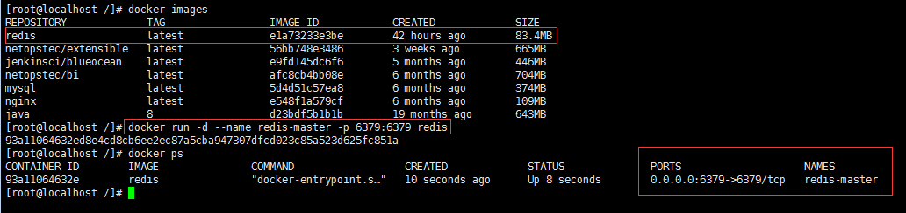

由于端口映射关系（-p 6379:6379）即将redis-master容器6379端口提供的服务（Redis服务暴露的端口默认就是6379），暴露在服务器的6379端口上。因此访问服务器的6379端口即可开始使用Redis服务。在Redis的桌面管理工具(Redis Desktop Manager)测试连接Redis成功如下：

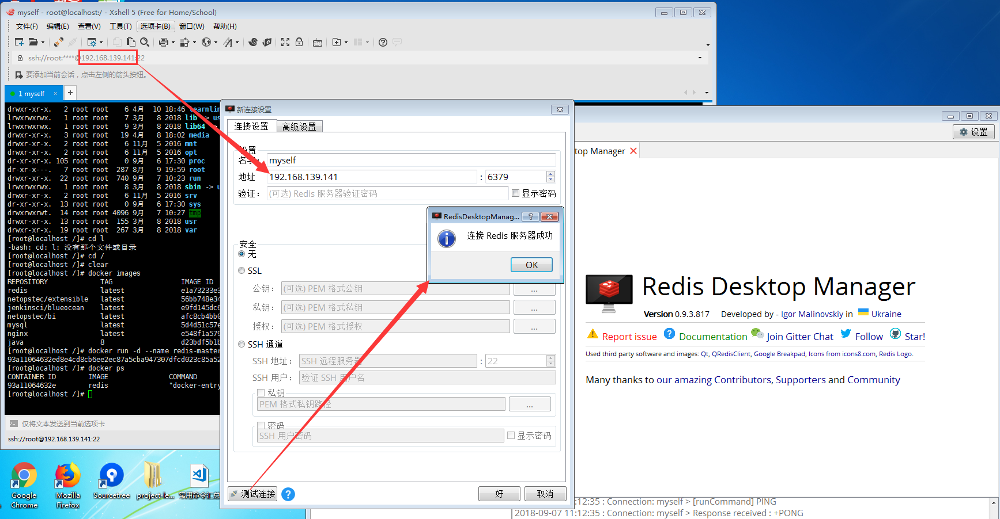

## Redis的命令

由于项目开发时启动的Redis容器都是后台型的，无法直接实践Redis命令。因此需要另外启动一个链接了Redis服务的Docker容器。

```BASH
# 启动链接到redis上的服务器(it:交互型容器 link:链接两个容器)
docker run --rm -it --link redis-master:redis redis /bin/bash

# 用redis-cli工具访问redis(h:主机 p:端口)，这里的端口不指定，它也会默认去访问主机的6379端口
redis-cli -h redis -p 6379
```

如下图所示，启动了交互型容器，就可以直接在命令行窗口实践redis命令了：

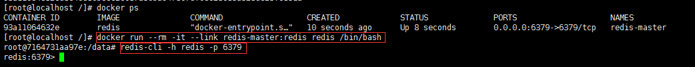

常用的Redis命令汇总如下

1. 与`key`相关的命令

|命令格式            |命令描述                         |命令示例              |
|-------------------|--------------------------------|----------------------|
|set key value      |设置指定key的value               |set name zhenye       |
|get key            |获取指定key的value               |get name              |
|getset key value   |替换指定key的value，并返回旧值    |getset name zhenye163 |
|expire key seconds |设置指定key的过期时间,单位为秒     |expire name 5         |
|ttl key            |返回指定key的剩余生存时间,单位为秒 |ttl name              |
|del key value      |删除指定key                      |del name              |

与`key`相关的命令测试效果如下：

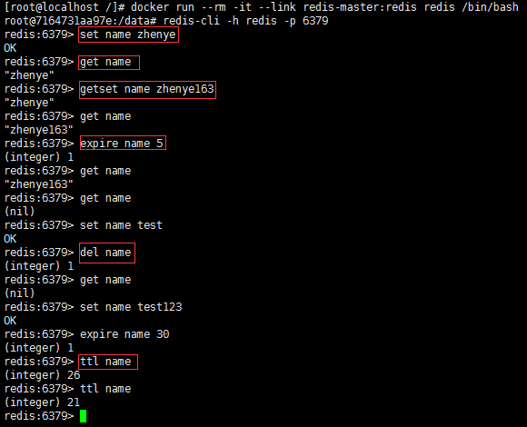

2. 与`list`相关的命令

|命令格式              |命令描述                    |命令示例                |
|---------------------|----------------------------|-----------------------|
|lpush key value      |顺序插入list中的value        |lpush database mysql   |
|lrange key start stop|返回list相应位置的value      |lrange database 0 1    |
|lindex key index     |通过索引获取列表中的元素      |lindex database 1      |
|lpop key             |移出列表中的第一个元素        |lpop database          |
|llen key             |获取列表的长度               |llen database          |

与`list`相关的命令测试效果如下：

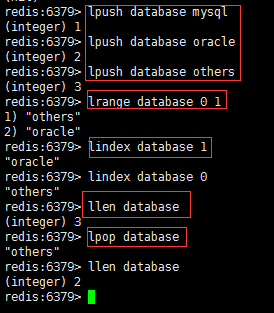

3. 与`set`相关的命令

|命令格式               |命令描述                    |命令示例                  |
|----------------------|----------------------------|-------------------------|
|sadd key member       |向set中插入一个元素          |sadd language java        |
|scard key             |返回set中元素的个数          |scard language            |
|smembers key          |返回set中所有的元素          |smembers language         |
|sismember key value   |判断set中是否存在某个元素    |sismember language java   |
|srem key value1 value2|移除set中一个或多个元素      |srem language java c      |

与`set`相关的命令测试效果如下：

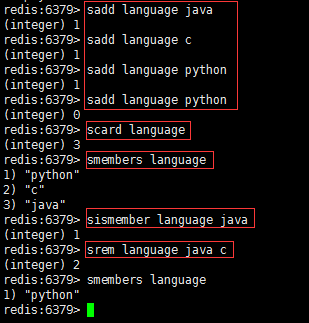

4. 与`zset`相关的命令

|命令格式                      |命令描述                              |命令示例                   |
|-----------------------------|--------------------------------------|--------------------------|
|zadd key score1 member1      |向zset中插入一个元素,score为排序时权重  |zadd week 1 monday         |
|zcard key                    |返回zset中元素的个数                   |zcard week                 |
|zrange key start stop        |返回zset索引区间（插入顺序）内所有的元素 |zrange week 1 3            |
|zincrby key increment member |给zset指定元素的排序权重加increment     |zincrby week 5 monday      |
|zrem key value1 value2       |移除zset中一个或多个元素                |zrem week tuesday thursday |

与`zset`相关的命令测试效果如下：

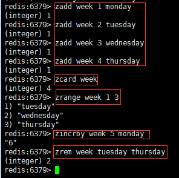

5. 与`hash`相关的命令

|命令格式                |命令描述                     |命令示例                        |
|-----------------------|----------------------------|--------------------------------|
|hmset key field1 value1|同时往hash表中存储多个键值对  |hmset person name zhenye age 25 |
|hexists key field      |判断hash表中是否存在字段field |hexists person name             |
|hkeys key              |取出hash表中所有字段          |hkeys person                    |
|hgetall key            |获取hash表中的所有信息        |lpop person                     |
|hdel key field         |删除hash表中的某些字段        |hdel person address             |

与`hash`相关的命令测试效果如下：

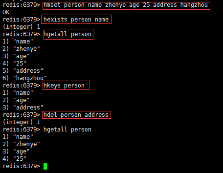

这里只是摘取了部分常用的命令，其他的命令及用户可参考[Redis官网的命令汇总](https://redis.io/commands#)

## SpringBoot项目中简单使用Redis

1. 首先在项目的pom文件中加入redis依赖

```XML
<dependency>
  <groupId>org.springframework.boot</groupId>
  <artifactId>spring-boot-starter-data-redis</artifactId>
</dependency>
```

2.在配置文件（application-dev.properties）中加入如下配置:

```
# 配置Redis
spring.redis.host=192.168.139.141
spring.redis.database=1
# 设置debug=true，可以看SpringBoot帮我们做了哪些自动配置
debug=true
```
启动项目可以发现，`positive matches`里面有：

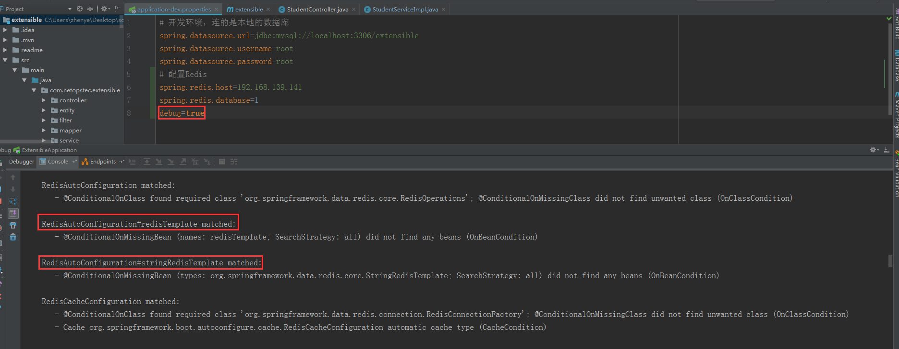

而真正使用Redis的服务，就是使用`RestTemplate/StringRestTemplate`类提供的方法。这里SpringBoot帮我们进行了Redis的相关配置，因此我们只需要注入这两个类，就可以使用Redis服务了。

3. 测试代码

```JAVA
@Service
@Slf4j
public class StudentServiceImpl implements StudentService{
  @Resource
  private StudentMapper studentMapper;
  @Resource
  private ClassroomMapper classroomMapper;
  @Autowired
  private StringRedisTemplate redisTemplate;

  @Transactional(rollbackFor = Exception.class)
  @Override
  public String insertOne(Student student) {
    log.info("插入一条新的学生数据");
    Integer classroomId = student.getClassroomId();
    Classroom classroom = classroomMapper.findById(classroomId);
    if (classroom == null){
      log.error("找不到这个班级");
      throw new RuntimeException("学生信息不全，无法入库");
    }
    Integer studentId = studentMapper.insertOne(student);
    student.setId(studentId);
    redisTemplate.opsForHash().put("student",String.valueOf(studentId),student.toString());
    return "SUCCESS";
  }
}
```

这里的做法是：在将student的信息插入MySql后，同时将student的信息（studentId:student）也插入Redis中。

4. 在Postman中进行如下测试：

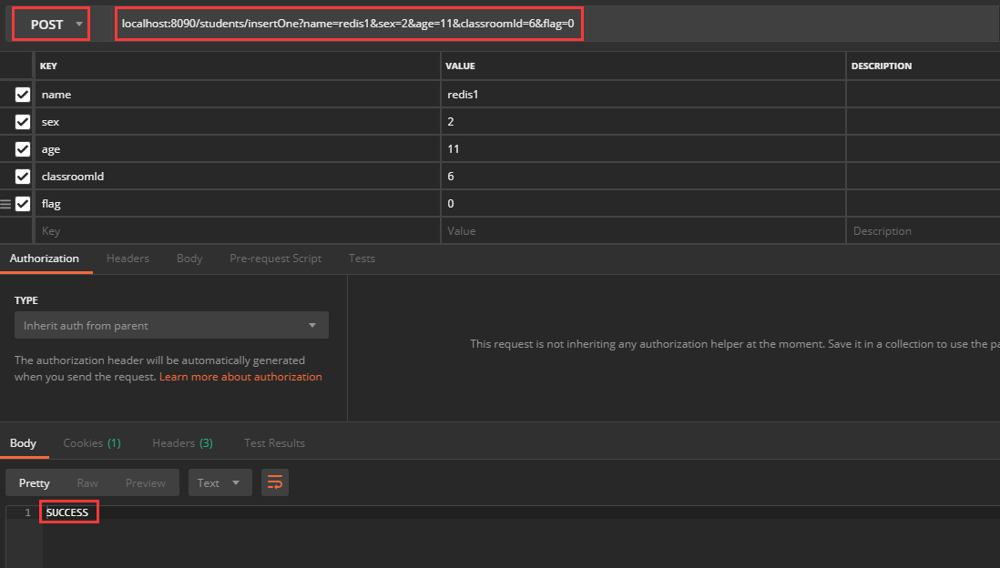

返回值为SUCCESS，说明方法走通，也说明student的信息存入了Redis中，用Redis桌面管理工具（Redis Desktop Manager）查看如下图，说明成功插入数据。

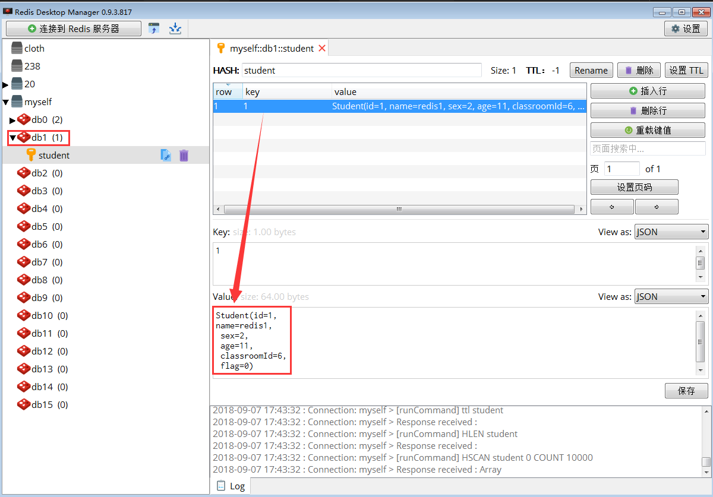

5. 将常用的Redis操作汇总成工具类

```JAVA
/**
 * 将常用的Redis操作汇聚成工具类
 * @author zhenye 2018/9/7
 */
@Configuration
@Slf4j
public class RedisUtil {

    /**
     * StringRedisTemplate继承RedisTemplate<String, String>，两种的区别仅仅是序列化方式不一样。
     * 这里选用StringRedisTemplate，能够避免乱码问题。
     */
    @Autowired
    private StringRedisTemplate stringRedisTemplate;

    /**
     * 判断key是否存在
     * @param key 键
     * @return true 存在 false不存在
     */
    public boolean hasKey(String key){
        try {
            return stringRedisTemplate.hasKey(key);
        } catch (Exception e) {
            log.error("error occurred in RedisUtil.hasKey(String key) ---> ",e);
            return false;
        }
    }

    /**
     * 指定key的过期时间为time，单位是秒
     * @param key 键
     * @param time 时间(秒)
     * @return
     */
    public boolean setExpire(String key, long time){
        try {
            if(time > 0){
                stringRedisTemplate.expire(key, time, TimeUnit.SECONDS);
            }
            return true;
        } catch (Exception e) {
            log.error("error occurred in RedisUtil.setExpire(String key, long time) ---> ",e);
            return false;
        }
    }

    /**
     * 根据key 获取过期时间
     * @param key 键 不能为null
     * @return 时间(秒) 返回0代表为永不过期
     */
    public long getExpire(String key){
        return stringRedisTemplate.getExpire(key,TimeUnit.SECONDS);
    }

    /**
     * 删除key
     * @param key 可以传一个值 或多个
     */
    public void del(String... key){
        if(key != null && key.length > 0){
            if(key.length == 1){
                stringRedisTemplate.delete(key[0]);
            }else{
                stringRedisTemplate.delete(CollectionUtils.arrayToList(key));
            }
        }
    }

    //============================String类型的方法=============================
    //存储格式为： key = value
    /**
     * 获取指定键的值
     * @param key 键
     * @return 值
     */
    public Object get(String key){
        return key == null ? null : stringRedisTemplate.opsForValue().get(key);
    }

    /**
     * 设置指定键的值，如果存在就是更新操作
     * @param key 键
     * @param value 值
     * @return true成功 false失败
     */
    public boolean set(String key,String value) {
        try {
            stringRedisTemplate.opsForValue().set(key, value);
            return true;
        } catch (Exception e) {
            log.error("error occurred in RedisUtil.set(String key,String value) ---> ",e);
            return false;
        }

    }

    /**
     * 设置指定键的值，同时设置过期时间
     * @param key 键
     * @param value 值
     * @param time 时间(秒) time要大于0 如果time小于等于0 将设置无限期
     * @return true成功 false 失败
     */
    public boolean set(String key,String value,long time){
        try {
            if(time > 0){
                stringRedisTemplate.opsForValue().set(key, value, time, TimeUnit.SECONDS);
            }else{
                set(key, value);
            }
            return true;
        } catch (Exception e) {
            log.error("error occurred in RedisUtil.set(String key,String value,long time) ---> ",e);
            return false;
        }
    }

    /**
     * 改变键的排序权重
     * @param key 键
     * @param delta 权重数
     * @return
     */
    public long incrBy(String key, long delta){
        return stringRedisTemplate.opsForValue().increment(key, delta);
    }

    //============================Hash类型的方法=============================
    //存储格式为： key = {field1: value1,field2: value2}
    // Redis中的Hash结构可以类比数据库（key是表名，field是列表）
    /**
     * HashGet
     * @param key 键
     * @param field 项
     * @return 该键某项的值value
     */
    public Object hget(String key,String field){
        return stringRedisTemplate.opsForHash().get(key, field);
    }

    /**
     * 获取该键的所有项值对{field1: value1,field2: value2}
     * @param key 键
     * @return 所有项值对
     */
    public Map<Object,Object> hmget(String key){
        return stringRedisTemplate.opsForHash().entries(key);
    }

    /**
     * 以键值对的方式把map信息保存在键key中
     * @param key 键
     * @param map 对应多个键值
     * @return true 成功 false 失败
     */
    public boolean hmset(String key, Map<String,Object> map){
        try {
            stringRedisTemplate.opsForHash().putAll(key, map);
            return true;
        } catch (Exception e) {
            log.error("error occurred in RedisUtil.hmset(String key, Map<String,Object> map) ---> ",e);
            return false;
        }
    }

    /**
     * 以键值对的方式把map信息保存在键key中，同时设置该键的过期时间
     * @param key 键
     * @param map 对应多个键值
     * @param time 时间(秒)
     * @return true成功 false失败
     */
    public boolean hmset(String key, Map<String,Object> map, long time){
        try {
            stringRedisTemplate.opsForHash().putAll(key, map);
            if(time > 0){
                setExpire(key, time);
            }
            return true;
        } catch (Exception e) {
            log.error("error occurred in RedisUtil.hmset(String key, Map<String,Object> map, long time) ---> ",e);
            return false;
        }
    }

    /**
     * 向一张hash表中放入数据,如果不存在将创建
     * @param key 键
     * @param field 项
     * @param value 值
     * @return true 成功 false失败
     */
    public boolean hset(String key,String field,String value) {
        try {
            stringRedisTemplate.opsForHash().put(key, field, value);
            return true;
        } catch (Exception e) {
            log.error("error occurred in RedisUtil.hset(String key,String field,Object value) ---> ",e);
            return false;
        }
    }

    /**
     * 向一张hash表中放入数据,如果不存在将创建
     * @param key 键
     * @param field 项
     * @param value 值
     * @param time 时间(秒)  注意:如果已存在的hash表有时间,这里将会替换原有的时间
     * @return true 成功 false失败
     */
    public boolean hset(String key,String field,String value,long time) {
        try {
            stringRedisTemplate.opsForHash().put(key, field, value);
            if(time>0){
                setExpire(key, time);
            }
            return true;
        } catch (Exception e) {
            log.error("error occurred in RedisUtil.hset(String key,String field,String value,long time) ---> ",e);
            return false;
        }
    }

    /**
     * 删除hash表中的值
     * @param key 键 不能为null
     * @param field 项 不能为null
     */
    public void hdel(String key, String field){
        stringRedisTemplate.opsForHash().delete(key,field);
    }

    /**
     * 判断hash表中是否有该项的值
     * @param key 键 不能为null
     * @param field 项 不能为null
     * @return true 存在 false不存在
     */
    public boolean hHasKey(String key, String field){
        return stringRedisTemplate.opsForHash().hasKey(key, field);
    }

    /**
     * hash递增 如果不存在,就会创建一个 并把新增后的值返回
     * @param key 键
     * @param field 项
     * @param by 排序权重改变值
     * @return
     */
    public double hincr(String key, String field, double by){
        return stringRedisTemplate.opsForHash().increment(key, field, by);
    }

    //============================Set类型的操作=============================
    /**
     * 根据key获取Set中的所有值
     * @param key 键
     * @return
     */
    public Set<String> sGet(String key){
        try {
            return stringRedisTemplate.opsForSet().members(key);
        } catch (Exception e) {
            log.error("error occurred in RedisUtil.sGet(String key) ---> ",e);
            return null;
        }
    }

    /**
     * 根据value从一个set中查询,是否存在
     * @param key 键
     * @param value 值
     * @return true 存在 false不存在
     */
    public boolean sHasKey(String key,String value){
        try {
            return stringRedisTemplate.opsForSet().isMember(key, value);
        } catch (Exception e) {
            log.error("error occurred in RedisUtil.sHasKey(String key,String value) ---> ",e);
            return false;
        }
    }

    /**
     * 将数据放入set缓存
     * @param key 键
     * @param values 值 可以是多个
     * @return 成功个数
     */
    public long sSet(String key, String...values) {
        try {
            return stringRedisTemplate.opsForSet().add(key, values);
        } catch (Exception e) {
            log.error("error occurred in RedisUtil.sSet(String key, String...values) ---> ",e);
            return 0;
        }
    }

    /**
     * 将set数据放入缓存
     * @param key 键
     * @param time 时间(秒)
     * @param values 值 可以是多个
     * @return 成功个数
     */
    public long sSetAndTime(String key,long time,String...values) {
        try {
            Long count = stringRedisTemplate.opsForSet().add(key, values);
            if(time>0) {
                setExpire(key, time);
            }
            return count;
        } catch (Exception e) {
            log.error("error occurred in RedisUtil.sSetAndTime(String key,long time,String...values) ---> ",e);
            return 0;
        }
    }

    /**
     * 获取set缓存的长度
     * @param key 键
     * @return
     */
    public long sGetSetSize(String key){
        try {
            return stringRedisTemplate.opsForSet().size(key);
        } catch (Exception e) {
            log.error("error occurred in RedisUtil.sGetSetSize(String key) ---> ",e);
            return 0;
        }
    }

    /**
     * 移除值为value的
     * @param key 键
     * @param values 值 可以是多个
     * @return 移除的个数
     */
    public long setRemove(String key, Object ...values) {
        try {
            Long count = stringRedisTemplate.opsForSet().remove(key, values);
            return count;
        } catch (Exception e) {
            log.error("error occurred in RedisUtil.setRemove(String key, Object ...values) ---> ",e);
            return 0;
        }
    }

    //============================List类型的操作=============================
    /**
     * 获取list缓存的内容
     * @param key 键
     * @param start 开始
     * @param end 结束  0 到 -1代表所有值
     * @return
     */
    public List<String> lGet(String key, long start, long end){
        try {
            return stringRedisTemplate.opsForList().range(key, start, end);
        } catch (Exception e) {
            log.error("error occurred in RedisUtil.lGet(String key, long start, long end) ---> ",e);
            return null;
        }
    }

    /**
     * 获取list缓存的长度
     * @param key 键
     * @return
     */
    public long lGetListSize(String key){
        try {
            return stringRedisTemplate.opsForList().size(key);
        } catch (Exception e) {
            log.error("error occurred in RedisUtil.lGetListSize(String key) ---> ",e);
            return 0;
        }
    }

    /**
     * 通过索引 获取list中的值
     * @param key 键
     * @param index 索引  index>=0时， 0 表头，1 第二个元素，依次类推；index<0时，-1，表尾，-2倒数第二个元素，依次类推
     * @return
     */
    public Object lGetIndex(String key,long index){
        try {
            return stringRedisTemplate.opsForList().index(key, index);
        } catch (Exception e) {
            log.error("error occurred in RedisUtil.lGetIndex(String key,long index) ---> ",e);
            return null;
        }
    }

    /**
     * 将list放入缓存
     * @param key 键
     * @param value 值
     * @return
     */
    public boolean lSet(String key, String value) {
        try {
            stringRedisTemplate.opsForList().rightPush(key, value);
            return true;
        } catch (Exception e) {
            log.error("error occurred in RedisUtil.lSet(String key, String value) ---> ",e);
            return false;
        }
    }

    /**
     * 将list放入缓存
     * @param key 键
     * @param value 值
     * @param time 时间(秒)
     * @return
     */
    public boolean lSet(String key, String value, long time) {
        try {
            stringRedisTemplate.opsForList().rightPush(key, value);
            if (time > 0) {
                setExpire(key, time);
            }
            return true;
        } catch (Exception e) {
            log.error("error occurred in RedisUtil.lSet(String key, String value, long time) ---> ",e);
            return false;
        }
    }

    /**
     * 将list放入缓存
     * @param key 键
     * @param value 值
     * @return
     */
    public boolean lSet(String key, List<String> value) {
        try {
            stringRedisTemplate.opsForList().rightPushAll(key, value);
            return true;
        } catch (Exception e) {
            log.error("error occurred in RedisUtil.lSet(String key, List<String> value) ---> ",e);
            return false;
        }
    }

    /**
     * 将list放入缓存
     * @param key 键
     * @param value 值
     * @return
     */
    public boolean lSet(String key, List<String> value, long time) {
        try {
            stringRedisTemplate.opsForList().rightPushAll(key, value);
            if (time > 0) {
                setExpire(key, time);
            }
            return true;
        } catch (Exception e) {
            log.error("error occurred in RedisUtil.lSet(String key, List<String> value, long time) ---> ",e);
            return false;
        }
    }

    /**
     * 根据索引修改list中的某条数据
     * @param key 键
     * @param index 索引
     * @param value 值
     * @return
     */
    public boolean lUpdateIndex(String key, long index,String value) {
        try {
            stringRedisTemplate.opsForList().set(key, index, value);
            return true;
        } catch (Exception e) {
            log.error("error occurred in RedisUtil.lUpdateIndex(String key, long index,String value) ---> ",e);
            return false;
        }
    }

    /**
     * 移除N个值为value
     * @param key 键
     * @param count 移除多少个
     * @param value 值
     * @return 移除的个数
     */
    public Long lRemove(String key,long count,String value) {
        try {
            return stringRedisTemplate.opsForList().remove(key, count, value);
        } catch (Exception e) {
            log.error("error occurred in RedisUtil.lRemove(String key,long count,String value) ---> ",e);
            return 0L;
        }
    }
}
```
6. 这些Redis工具方法的单元测试如下

在配置文件(test.properties)中配置好redis的地址后，测试代码如下：

- key及String类型

测试代码如下：

```JAVA
/**
 * @author zhenye 2018/9/10
 */
@RunWith(SpringRunner.class)
@SpringBootTest
public class RedisTest {

    private static final Logger log = LoggerFactory.getLogger(RedisTest.class);

    @Autowired
    private RedisUtil redisUtil;

    /**
     * 进行Redis的Key以及String类型数据操作的测试如下：
     */
    @Test
    public void redisKeyTest() throws Exception {
        log.info("开始进行Redis工具类RedisUtil的Key以及String类型数据操作相关方法的测试如下：");
        String key1 = "person1";
        boolean hasKey = redisUtil.hasKey(key1);
        log.info("检测redis中是否有Key[{}],检测结果为:{}.",key1,hasKey);
        if (hasKey){
            String key1Value = (String) redisUtil.get(key1);
            log.info("Key[{}]的值为:",key1Value);
        }
        String value1 = "zhenye1";
        redisUtil.set(key1,value1);
        hasKey = redisUtil.hasKey(key1);
        log.info("设置了Key[{}]的值为:{},此时再判断是否存在Key值结果为:{}",key1,value1,hasKey);
        Long toBeExpiredTime0 = redisUtil.getExpire(key1);
        log.info("不设置Key[{}]的过期时间，即表示永不过期---其过期时间默认值为{}",key1,toBeExpiredTime0);
        Long time1 = 10L;
        redisUtil.setExpire(key1,time1);
        log.info("设置了Key[{}]的过期时间为:{}",key1,time1);
        Long toBeExpiredTime1 = redisUtil.getExpire(key1);
        log.info("此时Key[{}]的剩余过期时间为:{}",key1,toBeExpiredTime1);
        Thread.sleep(5000L);
        Long toBeExpiredTime2 = redisUtil.getExpire(key1);
        log.info("此时Key[{}]的剩余过期时间为:{}",key1,toBeExpiredTime2);
        Thread.sleep(6000L);
        Long toBeExpiredTime3 = redisUtil.getExpire(key1);
        log.info("此时Key[{}]的剩余过期时间为:{},此时该键已经过期",key1,toBeExpiredTime3);
        String key2 = "person2";
        String value2 = "zhenye2";
        String key3 = "person3";
        String value3 = "zhenye3";
        redisUtil.set(key2,value2);
        redisUtil.set(key3,value3);
        log.info("设置Key2[{}]和Key3[{}]后，判断其是否存在:{}",key2,key3,(redisUtil.hasKey(key2) || redisUtil.hasKey(key3)));
        redisUtil.del(key2,key3);
        log.info("删除了Key2[{}]和Key3[{}]后,判断其是否存在:{}",key2,key3,(redisUtil.hasKey(key2) || redisUtil.hasKey(key3)));
    }
}
```

测试效果图如下：

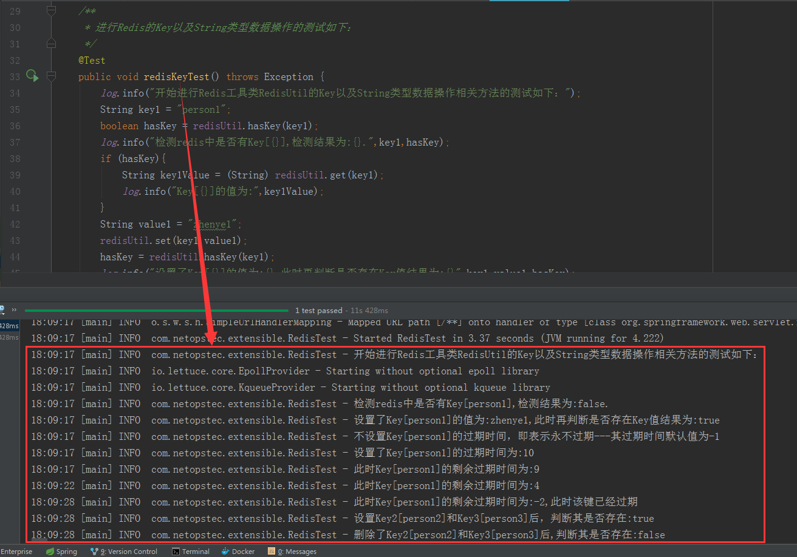

- `Hash`类型

测试代码如下：

```JAVA
/**
  * 进行Redis的Hash类型数据操作的测试如下：
  */
@Test
public void redisHashTest(){
    log.info("开始进行Redis工具类RedisUtil的Hash类型数据操作相关方法的测试如下：");
    log.info("下面的操作是往表[user]存入相应的信息");
    redisUtil.hset("user","userId1","{userId:1,name:zhenye1,age:25}");
    redisUtil.hset("user","userId2","{userId:2,name:zhenye2,age:26}");
    redisUtil.hset("user","userId3","{userId:3,name:zhenye3,age:27}");
    Map<Object,Object> map = redisUtil.hmget("user");
    log.info("获取表[user]的全表数据如下：{}",map);
    boolean hasField = redisUtil.hHasKey("user","userId3");
    log.info("判断表[user]是否存在Field[user3],其结果为:{}",hasField);
    String userId3Info = (String) redisUtil.hget("user","userId3");
    log.info("获取表[user]中Field[userId3]的值如下：{}",userId3Info);
    redisUtil.hset("user","userId3","{userId:4,name:zhenye4,age:25}");
    userId3Info = (String) redisUtil.hget("user","userId3");
    log.info("测试更改表[user]中Field[userId3]的值成功后，其值如下：{}",userId3Info);
    redisUtil.hdel("user","user3");
    hasField = redisUtil.hHasKey("user","user3");
    log.info("测试表[user]已经删除Field[user3],判断其是否还存在的结果为:{}",hasField);
}
```

测试效果图如下：

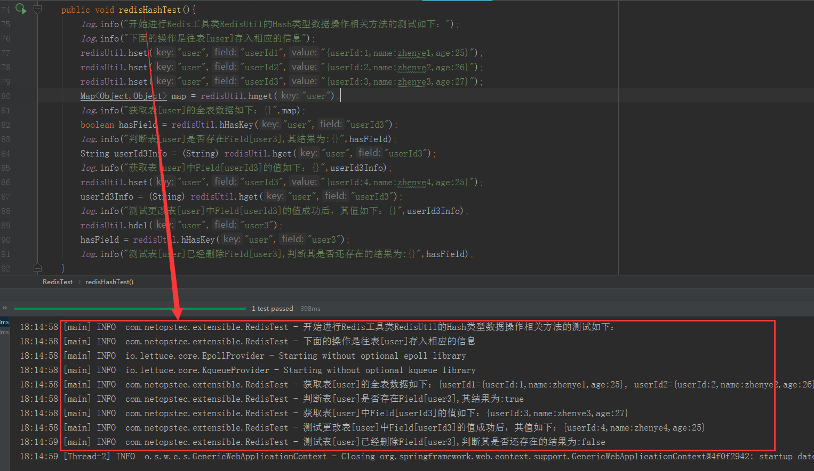

- `Set`类型

测试代码如下：

```JAVA
/**
  * 进行Redis的Hash类型数据操作的测试如下：
  */
@Test
public void redisSetTest(){
    log.info("开始进行Redis工具类RedisUtil的Set类型数据操作相关方法的测试如下：");
    log.info("下面的操作是往Set[number]中批量插入多条数据");
    redisUtil.sSet("number","1","2","3");
    Set<String> numbers = redisUtil.sGet("number");
    log.info("测试获取Set[number]中的所有数据，其结果为:{}",numbers);
    boolean hasNumber = redisUtil.sHasKey("number","2");
    log.info("测试Set[number]中是否有'2'，结果为:{}",hasNumber);
    Long setSize = redisUtil.sGetSetSize("number");
    log.info("测试获取Set[number]的长度为:{}",setSize);
    redisUtil.setRemove("number","2","3","4");
    numbers = redisUtil.sGet("number");
    log.info("测试批量删除Set[number]中的多条数据后，其数据为:{}",numbers);
}
```

测试效果图如下：

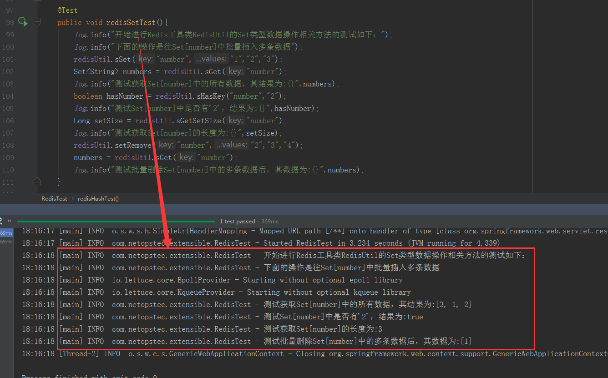

- `List`类型

测试代码如下：

```JAVA
/**
  * 进行Redis的List类型数据操作的测试如下：
  */
@Test
public void redisListTest() {
    log.info("开始进行Redis工具类RedisUtil的List类型数据操作相关方法的测试如下：");
    log.info("下面的操作是往List[color]中批量插入多条数据");
    redisUtil.lSet("color", Arrays.asList("red","blue","green","blue","green","blue"));
    String indexValue = (String) redisUtil.lGetIndex("color",2L);
    log.info("测试获取List[color]中指定下标[2L]的值：{}",indexValue);
    Long listSize = redisUtil.lGetListSize("color");
    log.info("测试获取List[color]的长度：{}",listSize);
    List<String> listValue = redisUtil.lGet("color",1L,10L);
    log.info("测试获取List[color]中指定下标范围start[1L]-end[10L]的值：{}",listValue);
    redisUtil.lRemove("color",2L,"blue");
    listValue = redisUtil.lGet("color",1L,10L);
    log.info("测试删除List[color]中2个'blue'后List的值为：{}",listValue);
    listValue = redisUtil.lGet("color",1L,10L);
    log.info("测试删除List[color]中2个'blue'后List的值为：{}",listValue);
}
```

测试效果图如下：

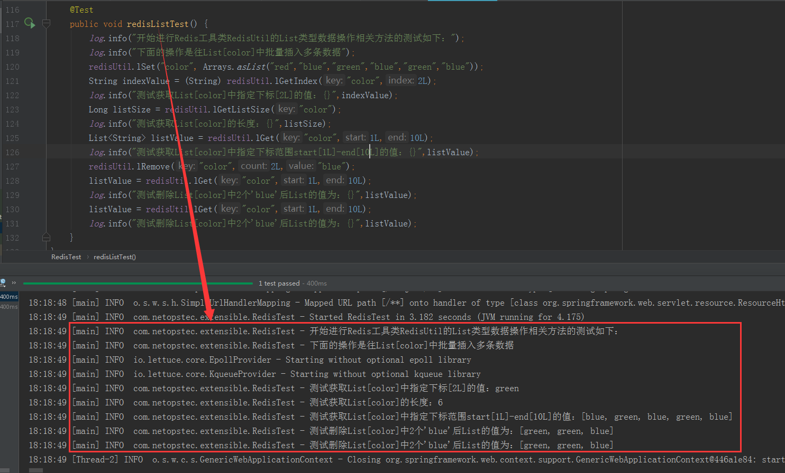