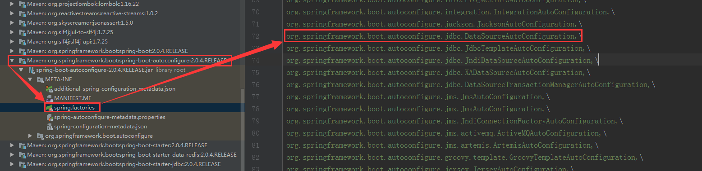
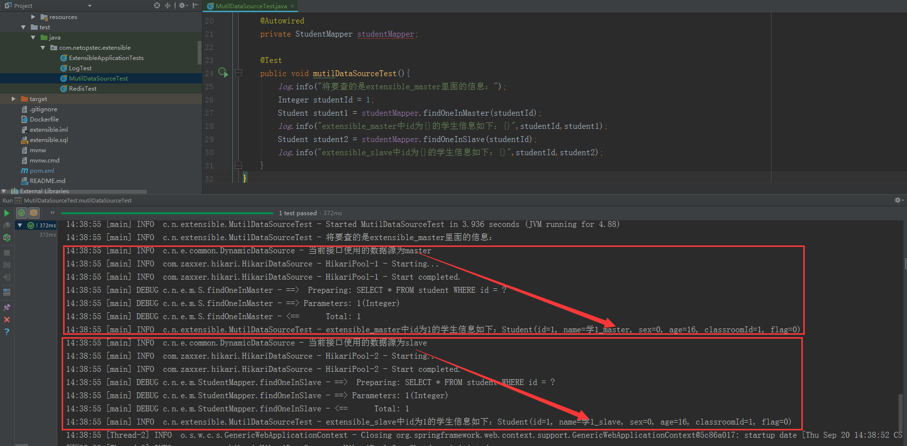

# 多数据源的使用场景
简单来说，Web项目业务功能的实现就是对“数据”的增、删、改、查功能的实现。<br/>
以“在TMALL购物”为例，这里的购物过程实现可简单拆分为：TMALL商城浏览商品，挑选要买的商品，下单等过程。<br/>
- “TMALL商城浏览商品”，就是把"tmall_goods"商品表里面的商品信息查出来，展示给顾客看---“查”。
- “挑选要买的商品”，就是把要买的商品添加到"shopping_cart"商品购物车表---“增”，然后既然是挑选商品，就可能需要修改购买某件商品的个数（修改"shopping_cart"商品购物车表中该条记录的个数信息---“改”），也可能删除不中意的商品（删除"shopping_cart"商品购物车表的该条记录---“删”）。
- “下单”，就是把购物车中要购买的商品列表信息，生成"order"订单表中的一条记录---“增”。

也就是说，<font color="red">web项目基础业务功能的实现，就是基于对不同“数据表”的增、删、改、查功能进行实现的</font>。当业务比较简单，这些不同的“数据表”是放在一个数据库里面。但是**当业务变得复杂，需要考虑数据安全（数据备份）、性能提升（主从复制、读写分离）时，我们就需要考虑多数据源---分库的实现**。

> 参考于百度百科。数据源（Data Source）顾名思义，数据的来源，是提供某种所需要数据的器件或原始媒体。在数据源中存储了所有建立数据库连接的信息。就像通过指定文件名称可以在文件系统中找到文件一样，通过提供正确的数据源名称，你可以找到相应的数据库连接。

通俗来讲，<font color="red">数据源，就是一条指明使用哪个数据库的路径。</font><br/>
我们用多个数据库来备份数据，或者用主从复制分库的方式提高性能，就都可以用“多数据源”的方式进行实现。

# 多数据源配置详解

SpringBoot的自动配置项里面，是包括对数据源的配置的。



因此，我们在配置文件application*.properties中配置好数据源必要的参数（driverClassName,url,username,password）后，SpringBoot就会帮我们创建数据源对象。再进行了Mybatis的相关配置后，我们就可以对该数据源对应数据库中的数据进行操作了。<br/>

1.我们要进行“Mybatis的数据源配置”，**第一步**，就是去掉SpringBoot对数据源的自动配置。

即在SpringBoot的入口函数的@SpringBootApplication注解加上`exclude = DataSourceAutoConfiguration.class`,源码如下：

```JAVA
@EnableAspectJAutoProxy
@EnableTransactionManagement
@SpringBootApplication(exclude = DataSourceAutoConfiguration.class)
public class ExtensibleApplication {

	public static void main(String[] args) {
		SpringApplication.run(ExtensibleApplication.class, args);
	}
}
```

2.**第二步**，我们需要把多数据源的信息在配置文件application*.properties中配置好，源码如下：

```BASH
# 主数据库的配置
master.datasource.driverClassName=com.mysql.jdbc.Driver
master.datasource.jdbcUrl=jdbc:mysql://localhost:3306/extensible_master
# ！！！当SpringBoot的版本为2.0以下时，url需要改成如下写法。
# master.datasource.url=jdbc:mysql://localhost:3306/extensible_master
master.datasource.username=root
master.datasource.password=root
# 副数据库的配置
slave.datasource.driverClassName=com.mysql.jdbc.Driver
slave.datasource.jdbcUrl=jdbc:mysql://localhost:3306/extensible_slave
slave.datasource.username=root
slave.datasource.password=root
```

这里我是配置了两个数据源（一主一从），需要注意一点的是：url的配置是受SpringBoot版本的影响的，**低于2.0版本时，用的字段名称是url；高于2.0版本时，用的字段名称是jdbcUrl。**

3.**第三步**，由于我们删除了SpringBoot对数据源的自动配置，我们就需要手动对数据源的配置。但考虑该Web项目中使用了多个数据源，考虑到程序的可读性，保证能够容易且清楚地知道每个Mapper接口里的方法具体使用的是哪个数据源。这里打算使用“自定义注解 + AOP方式”的实现动态数据源。

预先定义一个枚举类：

```JAVA
/**
 * 数据源类型的枚举类
 * @author zhenye 2018/9/17
 */
public enum DataSourceTypeEnum {
    /**
     * 数据源类型
     */
    master,slave
}
```

再定义一个注解（指定某个Mapper接口方法使用的是哪个数据源的注解）：

```JAVA
/**
 * 定义使用数据源的注解
 * @author zhenye 2018/9/17
 */
@Retention(RetentionPolicy.RUNTIME)
@Target(ElementType.METHOD)
public @interface DataSourceType {
    DataSourceTypeEnum value() default DataSourceTypeEnum.master;
}
```

再定义一个线程安全的、用来保存将要使用的数据源类型容器：

```JAVA
/**
 * 定义一个线程安全的、用来保存将要使用的数据源类型的Map容器
 * @author zhenye 2018/9/17
 */
public class DataSourceContextHolder {
    private static final ThreadLocal<DataSourceTypeEnum> CONTEXT_HOLDER = ThreadLocal.withInitial(() -> DataSourceTypeEnum.master);

    public static void setDataSourceType(DataSourceTypeEnum dataSourceTypeEnum){
        CONTEXT_HOLDER.set(dataSourceTypeEnum);
    }

    public static DataSourceTypeEnum getDataSourceType(){
        return CONTEXT_HOLDER.get();
    }
}
```

再定义动态数据源（动态数据源必须要继承AbstractRoutingDataSource）如下：

```JAVA
/**
 * 动态数据源的配置。
 * 必须要继承AbstractRoutingDataSource，且只需实现determineCurrentLookupKey()方法，指定当前使用的数据源就行。
 * @author zhenye 2018/9/17
 */
@Slf4j
public class DynamicDataSource extends AbstractRoutingDataSource {
    @Override
    protected Object determineCurrentLookupKey() {
        log.info("当前方法使用的数据源为{}", DataSourceContextHolder.getDataSourceType());
        return DataSourceContextHolder.getDataSourceType();
    }
}
```

然后再定义一个切面，能够根据Mapper接口中的方法上的@DataSourceType注解动态地切换数据源，具体源码如下：

```JAVA
/**
 * 数据源切面的配置
 * @author zhenye 2018/9/17
 */
@Aspect
@Component
public class DataSourceAspect {
    /**
      * 切点（匹配规则为：maper包下的所有方法）
      */
    @Pointcut("execution(* com.netopstec.extensible.mapper..*(..))")
    public void dataSourcePointcut(){}

    /**
     * 前置通知：
     * 逻辑是，扫描mapper包下的接口中的方法，没有@DataSourceType的注解，使用的数据源是master,
     * 注有@DataSourceType的注解，使用的数据源是该注解中value的值对应的数据源。
     */
    @Before("dataSourcePointcut()")
    public void before(JoinPoint joinPoint){
        MethodSignature methodSignature = (MethodSignature) joinPoint.getSignature();
        Method method = methodSignature.getMethod();
        DataSourceTypeEnum targetDataSourceType = DataSourceTypeEnum.master;
        if (method.isAnnotationPresent(DataSourceType.class)){
            DataSourceType setDataSourceType = method.getAnnotation(DataSourceType.class);
            targetDataSourceType = setDataSourceType.value();
        }
        DataSourceContextHolder.setDataSourceType(targetDataSourceType);
    }
}
```

最后，需要手动地对数据源进行配置（包括动态数据源），源码如下：

```JAVA
/**
 * @author zhenye 2018/9/17
 */
@Configuration
@MapperScan(basePackages = "com.netopstec.extensible.mapper")
public class MybatisConfig {

    @Autowired
    private Environment env;

    @Bean(name = "masterDataSource")
    @ConfigurationProperties(prefix = "master.datasource")
    @Primary
    public DataSource dataSourceMaster(){
        return DataSourceBuilder.create().build();
    }

    @Bean(name = "slaverDataSource")
    @ConfigurationProperties(prefix = "slave.datasource")
    public DataSource dataSourceSlave(){
        return DataSourceBuilder.create().build();
    }

    @Bean("dynamicDataSource")
    public DynamicDataSource dynamicDataSource(@Qualifier("masterDataSource") DataSource masterDataSource,
                                               @Qualifier("slaverDataSource") DataSource slaverDataSource) {

        Map<Object, Object> targetDataSources = new HashMap<>(2);
        targetDataSources.put(DataSourceTypeEnum.master, masterDataSource);
        targetDataSources.put(DataSourceTypeEnum.slave, slaverDataSource);

        DynamicDataSource dataSource = new DynamicDataSource();
        // 该方法是AbstractRoutingDataSource的方法
        dataSource.setTargetDataSources(targetDataSources);
        // 默认的datasource设置为biDataSource
        dataSource.setDefaultTargetDataSource(masterDataSource);
        return dataSource;
    }

    /**
     * 根据数据源创建SqlSessionFactory
     */
    @Bean
    public SqlSessionFactory sqlSessionFactory(@Qualifier("dynamicDataSource") DynamicDataSource dynamicDataSource) throws Exception {
        SqlSessionFactoryBean factoryBean = new SqlSessionFactoryBean();
        factoryBean.setDataSource(dynamicDataSource);
        // xml方式：指定XML位置和别名
        factoryBean.setMapperLocations(new PathMatchingResourcePatternResolver()
                .getResources(env.getProperty("mybatis.mapper-locations")));
        factoryBean.setTypeAliasesPackage(env.getProperty("mybatis.type-aliases-package"));
        // 配置自动驼峰命名
        SqlSessionFactory sqlSessionFactory = factoryBean.getObject();
        sqlSessionFactory.getConfiguration().setMapUnderscoreToCamelCase(Boolean.valueOf(env.getProperty("mybatis.configuration.map-underscore-to-camel-case")));
        return factoryBean.getObject();
    }

    /**
     * 配置事务管理器
     */
    @Bean
    public DataSourceTransactionManager transactionManager(DynamicDataSource dataSource) {
        return new DataSourceTransactionManager(dataSource);
    }
}
```

<font color="red">这里需要注意的是，在多个数据源之中，必须选取一个数据源加上注解@Primary</font>。注明默认使用是哪个数据源。

至此，所有“动态多数据源”的配置已经完成。
**最后**，在Mapper接口中的方法加上注解@DataSourceType,指明该方法使用的是哪个数据源，即最终会使用哪个数据源，如果不指定会默认指定的数据源master。

# 测试

由于application-test.properties的配置内容如下：

```BASh
# 主数据库的配置
master.datasource.driverClassName=com.mysql.jdbc.Driver
master.datasource.jdbcUrl=jdbc:mysql://localhost:3306/extensible_master
# ！！！当SpringBoot的版本为2.0以下时，url需要改成如下写法。
# master.datasource.url=jdbc:mysql://localhost:3306/extensible_master
master.datasource.username=root
master.datasource.password=root
# 副数据库的配置
slave.datasource.driverClassName=com.mysql.jdbc.Driver
slave.datasource.jdbcUrl=jdbc:mysql://localhost:3306/extensible_slave
slave.datasource.username=root
slave.datasource.password=root
# 配置Redis
spring.redis.host=192.168.139.141
spring.redis.database=1
```

结合application.properties与test配置文件里面定义的内容，因此测试之前必须在本地（localhost）准备好extensible_master和extensible_slave数据库，并启动192.168.139.141虚拟机上面的redis服务。

1.在本地创建好extensible_master和extensible_slave两个数据库，运行如下SQL语句（master和slave中各自都执行一次），导入测试数据：

```SQL
-- ----------------------------
-- Table structure for classroom
-- ----------------------------
DROP TABLE IF EXISTS `classroom`;
CREATE TABLE `classroom` (
  `id` int(11) NOT NULL AUTO_INCREMENT,
  `grade` int(8) DEFAULT NULL COMMENT '年级',
  `class_no` int(8) DEFAULT NULL COMMENT '班号',
  `chinese_teacher_id` int(11) DEFAULT NULL COMMENT '语文老师id',
  `math_teacher_id` int(11) DEFAULT NULL COMMENT '数学老师id',
  `english_teacher_id` int(11) DEFAULT NULL COMMENT '英语老师id',
  `flag` tinyint(1) DEFAULT NULL COMMENT '（0：未删除，1：已删除）',
  PRIMARY KEY (`id`)
) ENGINE=InnoDB AUTO_INCREMENT=11 DEFAULT CHARSET=utf8;

-- ----------------------------
-- Records of classroom
-- ----------------------------
INSERT INTO `classroom` VALUES ('1', '1', '1', '1', '2', '3', '0');
INSERT INTO `classroom` VALUES ('2', '1', '2', '4', '5', '6', '0');
INSERT INTO `classroom` VALUES ('3', '1', '3', '1', '5', '3', '0');
INSERT INTO `classroom` VALUES ('4', '1', '4', '4', '2', '6', '0');
INSERT INTO `classroom` VALUES ('5', '2', '1', '7', '8', '9', '0');
INSERT INTO `classroom` VALUES ('6', '2', '2', '10', '11', '12', '0');
INSERT INTO `classroom` VALUES ('7', '2', '3', '7', '11', '12', '0');
INSERT INTO `classroom` VALUES ('8', '3', '1', '13', '14', '15', '0');
INSERT INTO `classroom` VALUES ('9', '3', '2', '16', '17', '18', '0');
INSERT INTO `classroom` VALUES ('10', '3', '3', '16', '14', '15', '0');

-- ----------------------------
-- Table structure for student
-- ----------------------------
DROP TABLE IF EXISTS `student`;
CREATE TABLE `student` (
  `id` int(11) NOT NULL AUTO_INCREMENT COMMENT '主键id',
  `name` varchar(32) DEFAULT NULL COMMENT '名称',
  `sex` tinyint(1) DEFAULT NULL COMMENT '性别（0：男、1：女）',
  `age` int(8) DEFAULT NULL COMMENT '年龄',
  `classroom_id` int(11) DEFAULT NULL COMMENT '属于哪个班级',
  `flag` tinyint(1) DEFAULT NULL COMMENT '（0：未删除，1：已删除）',
  PRIMARY KEY (`id`)
) ENGINE=InnoDB AUTO_INCREMENT=41 DEFAULT CHARSET=utf8;

-- ----------------------------
-- Records of student
-- ----------------------------
INSERT INTO `student` VALUES ('1', '学1', '0', '16', '1', '0');
INSERT INTO `student` VALUES ('2', '学2', '0', '16', '1', '0');
INSERT INTO `student` VALUES ('3', '学3', '1', '15', '1', '0');
INSERT INTO `student` VALUES ('4', '学4', '1', '16', '1', '0');
INSERT INTO `student` VALUES ('5', '学5', '1', '16', '2', '0');
INSERT INTO `student` VALUES ('6', '学6', '0', '16', '2', '0');
INSERT INTO `student` VALUES ('7', '学7', '1', '17', '2', '0');
INSERT INTO `student` VALUES ('8', '学8', '0', '17', '2', '0');
INSERT INTO `student` VALUES ('9', '学9', '1', '16', '3', '0');
INSERT INTO `student` VALUES ('10', '学10', '1', '16', '3', '0');
INSERT INTO `student` VALUES ('11', '学11', '1', '15', '3', '0');
INSERT INTO `student` VALUES ('12', '学12', '0', '17', '3', '0');
INSERT INTO `student` VALUES ('13', '学13', '0', '17', '4', '0');
INSERT INTO `student` VALUES ('14', '学14', '0', '17', '4', '0');
INSERT INTO `student` VALUES ('15', '学15', '1', '18', '4', '0');
INSERT INTO `student` VALUES ('16', '学16', '1', '19', '4', '0');
INSERT INTO `student` VALUES ('17', '学17', '0', '17', '5', '0');
INSERT INTO `student` VALUES ('18', '学18', '1', '17', '5', '0');
INSERT INTO `student` VALUES ('19', '学19', '0', '17', '5', '0');
INSERT INTO `student` VALUES ('20', '学20', '1', '16', '5', '0');
INSERT INTO `student` VALUES ('21', '学21', '1', '17', '6', '0');
INSERT INTO `student` VALUES ('22', '学22', '1', '17', '6', '0');
INSERT INTO `student` VALUES ('23', '学23', '0', '19', '6', '0');
INSERT INTO `student` VALUES ('24', '学24', '1', '17', '6', '0');
INSERT INTO `student` VALUES ('25', '学25', '0', '16', '7', '0');
INSERT INTO `student` VALUES ('26', '学26', '1', '18', '7', '0');
INSERT INTO `student` VALUES ('27', '学27', '0', '17', '7', '0');
INSERT INTO `student` VALUES ('28', '学28', '1', '16', '7', '0');
INSERT INTO `student` VALUES ('29', '学29', '0', '18', '8', '0');
INSERT INTO `student` VALUES ('30', '学30', '1', '17', '8', '0');
INSERT INTO `student` VALUES ('31', '学31', '0', '18', '8', '0');
INSERT INTO `student` VALUES ('32', '学32', '1', '17', '8', '0');
INSERT INTO `student` VALUES ('33', '学33', '0', '19', '9', '0');
INSERT INTO `student` VALUES ('34', '学34', '1', '18', '9', '0');
INSERT INTO `student` VALUES ('35', '学35', '0', '18', '9', '0');
INSERT INTO `student` VALUES ('36', '学36', '1', '17', '9', '0');
INSERT INTO `student` VALUES ('37', '学37', '0', '18', '10', '0');
INSERT INTO `student` VALUES ('38', '学38', '1', '19', '10', '0');
INSERT INTO `student` VALUES ('39', '学', '0', '18', '10', '0');
INSERT INTO `student` VALUES ('40', '学', '1', '18', '10', '0');

-- ----------------------------
-- Table structure for teacher
-- ----------------------------
DROP TABLE IF EXISTS `teacher`;
CREATE TABLE `teacher` (
  `id` int(11) NOT NULL AUTO_INCREMENT COMMENT '主键id',
  `name` varchar(32) DEFAULT NULL COMMENT '名称',
  `sex` tinyint(1) DEFAULT NULL COMMENT '性别（0：男、1：女）',
  `age` int(8) DEFAULT NULL COMMENT '年龄',
  `subject` varchar(32) DEFAULT NULL COMMENT '所授学科',
  `flag` tinyint(1) DEFAULT NULL COMMENT '（0：未删除，1：已删除）',
  PRIMARY KEY (`id`)
) ENGINE=InnoDB AUTO_INCREMENT=19 DEFAULT CHARSET=utf8;

-- ----------------------------
-- Records of teacher
-- ----------------------------
INSERT INTO `teacher` VALUES ('1', '语1', '0', '31', '语文', '0');
INSERT INTO `teacher` VALUES ('2', '数1', '0', '31', '数学', '0');
INSERT INTO `teacher` VALUES ('3', '英1', '1', '33', '英语', '0');
INSERT INTO `teacher` VALUES ('4', '语2', '1', '35', '语文', '0');
INSERT INTO `teacher` VALUES ('5', '数2', '0', '37', '数学', '0');
INSERT INTO `teacher` VALUES ('6', '英2', '1', '31', '英语', '0');
INSERT INTO `teacher` VALUES ('7', '语3', '0', '35', '语文', '0');
INSERT INTO `teacher` VALUES ('8', '数3', '1', '26', '数学', '0');
INSERT INTO `teacher` VALUES ('9', '英3', '0', '41', '英语', '0');
INSERT INTO `teacher` VALUES ('10', '语4', '1', '27', '语文', '0');
INSERT INTO `teacher` VALUES ('11', '数4', '0', '47', '数学', '0');
INSERT INTO `teacher` VALUES ('12', '英4', '0', '32', '英语', '0');
INSERT INTO `teacher` VALUES ('13', '语5', '1', '30', '语文', '0');
INSERT INTO `teacher` VALUES ('14', '数5', '1', '35', '数学', '0');
INSERT INTO `teacher` VALUES ('15', '英5', '1', '29', '英语', '0');
INSERT INTO `teacher` VALUES ('16', '语6', '0', '43', '语文', '0');
INSERT INTO `teacher` VALUES ('17', '数6', '0', '42', '数学', '0');
INSERT INTO `teacher` VALUES ('18', '英6', '1', '38', '英语', '0');

```

2.在Mapper接口中定义两个测试方法如下：

```JAVA
@Mapper
public interface StudentMapper {
  /**
     * 测试多数据源是否配置成功
     */
    @DataSourceType(DataSourceTypeEnum.master)
    Student findOneInMaster(Integer studentId);

    @DataSourceType(DataSourceTypeEnum.slave)
    Student findOneInSlave(Integer studentId);
}
```

3.在该接口对应的xml(StudentMapper.xml)添加这两个方法的具体实现如下：

```XML
<?xml version="1.0" encoding="UTF-8"?>
<!DOCTYPE mapper PUBLIC "-//mybatis.org//DTD Mapper 3.0//EN" "http://mybatis.org/dtd/mybatis-3-mapper.dtd">
<mapper namespace="com.netopstec.extensible.mapper.StudentMapper">
<select id="findOneInMaster" parameterType="Integer" resultType="Student">
        SELECT * FROM student
        WHERE id = #{studentId}
    </select>

    <select id="findOneInSlave" parameterType="Integer" resultType="Student">
        SELECT * FROM student
        WHERE id = #{studentId}
    </select>
</mapper>
```

4.测试代码如下：

```JAVA
@SpringBootTest
@RunWith(SpringRunner.class)
@Slf4j
public class MutilDataSourceTest {

    @Autowired
    private StudentMapper studentMapper;

    @Test
    public void mutilDataSourceTest(){
        log.info("将要查的是extensible_master里面的信息：");
        Integer studentId = 1;
        Student student1 = studentMapper.findOneInMaster(studentId);
        log.info("extensible_master中id为{}的学生信息如下：{}",studentId,student1);
        Student student2 = studentMapper.findOneInSlave(studentId);
        log.info("extensible_slave中id为{}的学生信息如下：{}",studentId,student2);
    }
}
```

> 为了让测试效果更加明显，我们把extensible_master.student表中id为1的记录中，name改为学1_master，把extensible_slave.student表中id为1的记录中，name改为学1_slave。

测试效果如下：



出现如上图效果，则说明Mybatis多数据源的配置成功。

# 声明

目前Github上的该项目还不是很完善，还缺少的是：定时同步信息（将extensible_master里面的数据，定时同步到redis和extensible_slave中）。下一次，总结的是：SpringBoot整合Quartz,并会把相关的功能完善。