# SpringBoot整合ElasticSearch

## 前言

 <font color="red">`ElasticSearch`是一个开源的高扩展的分布式全文检索引擎。</font><br/>
 它可以近乎实时（延迟1秒）的存储、检索并处理`PB`级别的数据。<br/>
 它是一个基于`Lucene`的搜索服务器。使用`Java`开发通过简单的`RestFul API`提供全文检索功能，这种做法隐藏了全文检索功能内部实现的复杂性。

 ## 核心概念

 `Document`，`文档`。`文档`是`ElasticSearch`中数据存储的基础单元。我们可以将`文档`理解为一条以`json`格式存储信息的记录。例如：我们可以在`ElasticSearch`中用`文档`这样描述一条商品信息：
 ```json
 {
     "name": "羽绒服",
     "brand": "南极人",
     "season": "冬季款",
     "size": ["S", "M", "XL", "XXL", "XXXL"],
     "price": 998
 }
 ```

 `Type`，`类型`。`类型`是将一类相似的`文档`进行归类。如：可以将京东的商品信息归为类型`type = jd`，将天猫的商品信息归为类型`type = tmall`，将亚马逊的商品信息归为类型`type = amazon`等等。
 <font color="red">`ElasticSearch`已经不推荐使用`类型`，当前最新的ElasticSearch版本是`6.6`。ElasticSearch-6.x版本中一个`索引`只允许有一个`类型`，7.x版本中会彻底删除`类型`。</font>

`Index`，`索引`。`索引`就是存放`文档`的地方，目前可以存放一个或多个`类型`。数据必须要指定存放的索引，才能被检索到。

> 为了便于理解，我们可以简单的类比：`索引`相当于数据库，`类型`相当于表，`文档`相当于表记录。但是`ElasticSearch`并不是关系型数据库，`索引`中可以不存放`类型`，直接存放`文档`。

`Cluster和Node`，`集群与节点`。由于`ElasticSearch`可以存放并检索`PB`级别的数据，一台服务器是存放不了这么多数据的，而且从`ElasticSearch的高可用以及容灾性`来考虑，必定是用多个服务器协调存储数据的。`节点`就是具备`ElasticSearch`环境并存放有数据的单个服务器。`集群`就是所有可用的节点组成的网状图。

它们的关系图我们可以理解如下：


`Primary shard和Replica shard`，`主分片和副本分片`。`分片`就是对`索引`的切分。一个`索引`默认会被分成5个`主分片`。`副本分片`就是`主分片`的数据备份，`主分片`可以有对应的零个或多个`副本分片`。`主分片`和其对应的`副本分片`是不会放在一个服务器的。这个很好理解，数据检索时，检索的是`主分片`上的数据，当`主分片`所在`节点`出现故障时，其对应的`副本节点`就会升级为`主节点`，保证`ElasticSearch的高可用`。

 ## 准备工作

 这篇博客需要的所有安装包，我都下载好并分享在[](我的百度网盘)，分享码是： ``。

 > 由于要保证`ElasticSearch`的高可用，搭建的`ElasticSearch集群`至少需要2个`节点`。本篇文章使用的`ElasticSearch集群`中会有3个`节点`，也就是需要在3个虚拟机中分别搭建`ElasticSearch`所需要的环境。

 <font color="red">以下命令在3个空白的虚拟机中都需要执行一次，保证每个虚拟机都具备同样的`ElasticSearch环境`。</font>

 <font color="red">ps:</font> 说个题外话，一不小心把之前的虚拟机数据删除并清空回收站了。感觉自己没带脑子。。。因此下面的命令都是亲测有效。

 ### 通过CentOS-7镜像新建虚拟机

 通过`VM工作站`中的`新建虚拟机`来创建我们需要的虚拟机。在安装过程中，虚拟机的配置<font color="red">大部分采纳提示所给的默认配置</font>，这里需要如下两个地方自定义配置：

1. 选用从我的网盘中下载的映像文件

 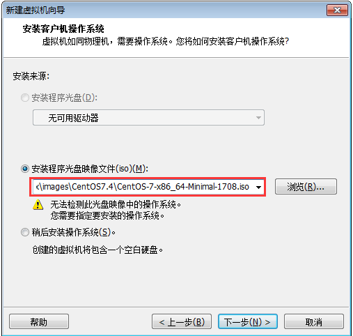

2. 虚拟机命名以及选取虚拟机文件数据的存放位置

 

 > 由于虚拟机的映像文件和文件数据较大，一般不放在C盘，防止系统文件所在磁盘空间不足，导致电脑性能降低。如可以把映像文件放在`F:\linux\images`，把虚拟机数据文件放在`F:\linux\virtualmachines`，这样也方便后期对虚拟机数据的管理。

 安装完成后，虚拟机的默认硬件配置如下：

 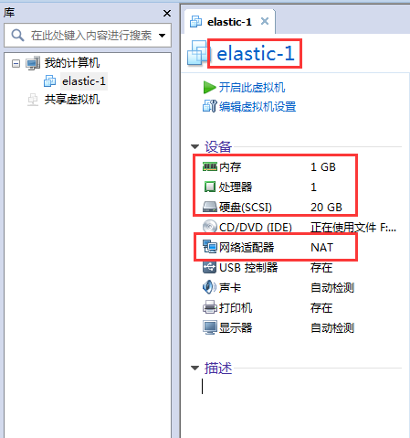

 也就是说这里有一个名为“elastic-1”的虚拟机，它的配置信息是：内存1G、CPU1个、硬盘20G、网络适配器NAT模式。如果我们的工作环境不是经常变动（在家办公与在公司办公连接的局域网不一样，无法使用“桥接模式”），我们可以考虑将网络适配器选用“桥接模式”，这样虚拟机的ip地址就不会经常变动。

 开启虚拟机后，还需要对虚拟机进行一些简单的配置。这些配置会以视图的方式进行提示：

 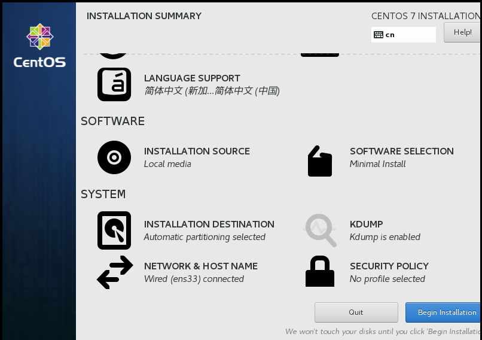

 如：编辑`DATE & TIME`选择所在时区；编辑`LANGUAGE SUPPORT`选择支持语言；编辑`INSTALLATION DESTINATION`选择磁盘位置及大小；编辑`NETWORK & HOST NAME`选择可以联网；编辑`ROOT PASSWORD`保存root用户的登录密码。

 > 点击`Begin Installation`会进行虚拟机的初始化。需要虚拟机初始化完成后，点击`Reboot`，等虚拟机重新启动后，我们才能用<font color="red">刚刚保存的root用户的密码</font>登录虚拟机并进行操作。因此这个密码一定要保证足够简单好记。

 以root用户登录成功后，然后需要执行如下命令。

```bash
# 以centos7自带工具yum安装net-tools
yum install net-tools.x86_64
```

如下图所示：

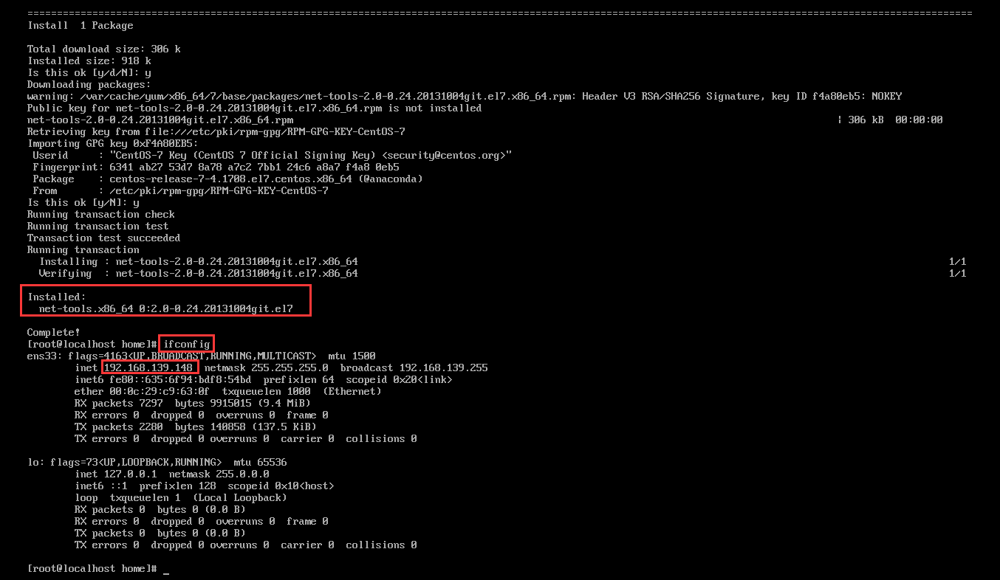

安装`net-tools`工具后，通过`ifconfig`命令获知该虚拟机的`ip`为：`192.168.139.148`。此时我们可以在该虚拟机的命令行界面操作，也可以通过`ssh协议`连接并登录虚拟机后，在`Xshell`的命令行界面操作。

```bash
# centos7自带的yum工具版本可能较低，需要更新至最新的版本
yum update
# 安装wget工具
yum install wget
```

### `JDK8`环境配置

`ElasticSearch官网`明确指出，使用ElasticSearch需要jdk8环境。

JDK8压缩包下载方式：

方式一：我们可以用`wget --no-check-certificate --no-cookies --header "Cookie: oraclelicense=accept-securebackup-cookie" http://download.oracle.com/otn-pub/java/jdk/8u172-b11/a58eab1ec242421181065cdc37240b08/jdk-8u172-linux-x64.tar.gz`命令直接在虚拟机中下载JDK8。

方式二：去[oracle官网](https://www.oracle.com/technetwork/java/javase/downloads/jdk8-downloads-2133151.html)下载`jdk-8u201-linux-x64.tar.gz`预先在本地电脑下载JDK8。

这里更推荐使用第二种方式。本地电脑中下载网速更稳定，并且我们可以留以备份（3个虚拟机中都需要安装JDK8）。

```bash
# 新建存放JDK的目录
mkdir -p /home/env/jdk
cd /home/env/jdk
# 这里将在本地电脑下载好的jdk-8u161-linux-x64.tar.gz，通过WinSCP工具复制到当前目录，复制成功后，解压
tar -xzvf jdk-8u161-linux-x64.tar.gz
```

解压成功后，当前目录会多出一个目录`jdk1.8.0_161`，如图所示：

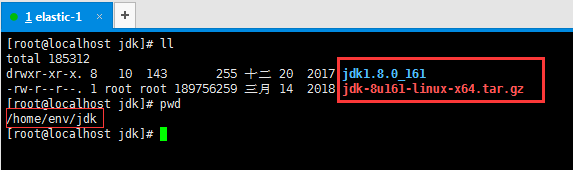

还需要执行如下命令，将`jdk8`加到`$PATH`中，保证`ElasticSearch`能找到。

```bash
# 安装vim文本编辑器工具
yum install vim
# 编辑配置文件
vim /etc/profile
# 在该配置文件尾部追加如下内容
export JAVA_HOME=/home/env/jdk/jdk1.8.0_161
export JRE_HOME=/home/env/jdk/jdk1.8.0_161/jre
export CLASSPATH=.:$JAVA_HOME/lib:$JRE_HOME/lib:$CLASSPATH
export PATH=$PATH:$JAVA_HOME/bin
# 保存退出后，执行如下命令，使配置即时生效（默认重启虚拟机才能生效）
source /etc/profile
# 通过如下命令验证jdk环境变量是否配置成功
java -version
```

命令效果如下图所示则说明jdk环境变量配置成功。

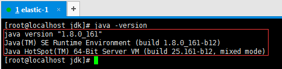

### 新建es用户

elasticsearch的开发者认为以`root`用户使用elasticsearch服务不安全，因此这里统一使用`es`用户使用elasticsearch服务。

```bash
# 添加一个es用户
useradd es
# 配置es的密码，为了方便也可以不配置密码。
passwd es
# 通过该命令能查看es用户的信息
id es
```

`es用户`创建成功后，系统会自动在`/home`目录下再创建一个同名目录`es`,这个目录就是`es用户`的工作目录，其所有者就是`es`。如下图所示：

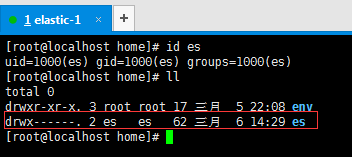

 ## `ElasticSearch`及其常用插件安装

 ### `ElasticSearch`安装

 方式一：我们可以通过`wget https://artifacts.elastic.co/downloads/elasticsearch/elasticsearch-6.3.2.tar.gz`下载。（6.3.2是版本号）

 方式二：我们可以根据需要，到[es官网的历史版本记录](https://www.elastic.co/downloads/past-releases)下载我们需要的版本。

 这两种方式没有任何差异。我们必须要注意的是确定好elasticsearch的版本。elasticsearch的版本迭代非常快，版本之间差异较大。现在最新elasticsearch稳定版本是`6.6.1`，然而网上大部分的博客教程等资料都是基于5.x甚至是2.x的版本。<font color="red">本篇博客选用的版本是`6.3.2`。</font>

```bash
# 安装zip/unzip工具
yum install -y unzip zip
# 切换当前用户为es
su es
# 新建存放elasticsearch的目录
mkdir -p /home/es/elasticsearch
cd /home/es/elasticsearch
# 可以通过wget命令下载，也可以先在本地电脑下载好通过WinSCP将elasticsearch压缩包传输到当前目录
# 解压该压缩包
unzip elasticsearch-6.3.2.zip
# 通过es用户执行./elasticsearch-6.3.2/bin/elasticsearch，即可启动elasticsearch服务
./elasticsearch-6.3.2/bin/elasticsearch
# 通过curl命令能够查看elasticsearch服务是否已经启动
curl -XGET "localhost:9200"
```

`/elasticsearch-6.3.2`的目录结构如下：

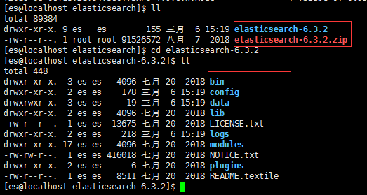

看这些目录的名称很容易就知道目录的作用。这里需要着重关注的是`config`、`logs`和`plugins`。<br/>
当需要修改elasticsearch的配置时，主要是修改配置文件`config/elasticsearch.yml`和`config/jvm.options`。<br/>
当elasticsearch服务报错，我们需要进行错误排查时，需要查看日志文件`logs/elasticsearch.log`。<br/>
elasticsearch还提供了一些比较好用的插件，我们可以在github下载插件源码，存放到`plugins`后重启elasticsearch服务即可。

通过执行`bin/elasticsearch`命令，我们可以查看`elasticsearch启动日志`如下图所示：

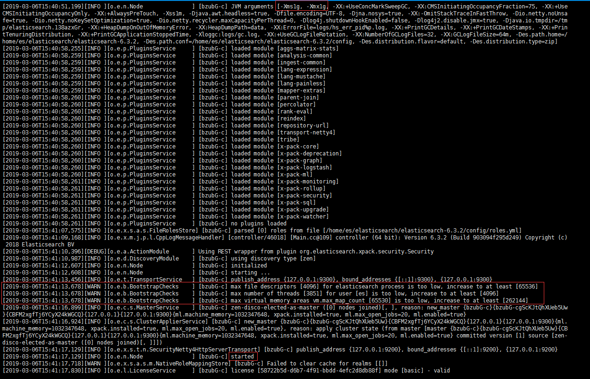

elasticsearch启动日志显示：elasticsearch服务已经成功启动。<br/>
通过`curl -XGET 'localhost:9200'`命令的执行结果也表明：elasticsearch服务已经成功启动。


但是日志里面有一些警告信息不能忽略。

1. `-Xms1g, -Xmx1g`显示：`elasticsearch`默认指定的堆内存为`1G`。前面说过该虚拟机的硬件配置总内存只有`1G`。把所有的内存全分配给`elasticsearch`肯定是不可取的。
2. `max file descriptors [4096] for elasticsearch process is too low, increase to at least [65536]`，`max number of threads [3851] for user [es] is too low, increase to at least [4096]`，`max virtual memory areas vm.max_map_count [65530] is too low, increase to at least [262144]`等警告日志信息表明：elasticsearch进程的文件解释器不够，分配给es用户的最大线程数也不够，当前es用户拥有的内存权限也不够。

具体解决办法如下：

```bash
# 修改jvm配置
vim /home/es/elasticsearch/elasticsearch-6.3.2/config/jvm.options
# 修改如下堆内存配置信息
-Xms512m
-Xmx512m
# 以下配置只能由root用户进行修改。需要切换当前用户为root
su root
# 编辑安全限制配置文件
vim /etc/security/limits.conf
# 并添加内容如下：
* soft nofile 65536
* hard nofile 131072
* soft nproc 2048
* hard nproc 4096
# 编辑内存限制配置文件
vim /etc/sysctl.conf
# 并添加内容如下：
vm.max_map_count=262144
# 保存退出后执行如下命令
sysctl -p
```

重启elasticsearch服务，无上述警告日志信息，则配置生效。

### head插件

从elasticsearch更新到`6.*`版本后，不再支持以elasticsearch插件的形式安装head插件。也就是下载的head插件不能放在`/elasticsearch/elasticsearch-6.3.2/plugins`目录。我选择把其放在`/elasticseach`的目录下。具体安装如下：

```bash
# 切换当前用户为root
su root
# 安装git
yum install git
cd /home/es/elasticsearch
# 将head插件的源码克隆到当前目录
git clone git://github.com/mobz/elasticsearch-head.git
```

克隆成功后，目录结构如下图所示：

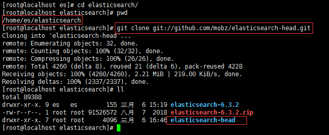

```bash
# 配置node环境
mkdir -p /home/env/node
cd /home/env/node
# 将从node官网下载最新版本的node压缩包传输到该目录中，然后解压
tar -xvf node-v10.15.3-linux-x64.tar.xz
# 将node加入环境变量
vim /etc/profile
# 添加内容如下：
export NODE_HOME=/home/env/node/node-v10.15.3-linux-x64
export PATH=$PATH:$NODE_HOME/bin/
export NODE_PATH=$NODE_HOME/lib/node_modules
# 使配置即时生效
source /etc/profile
# 测试node是否已经添加到环境变量中
node -v
npm -v
```

如下图所示则说明node环境配置完成：

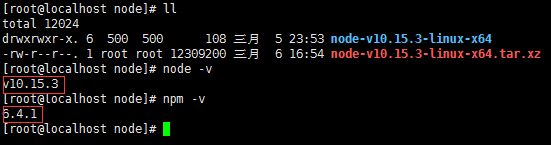

```bash
# 切换工作目录
cd /home/es/elasticsearch/elasticsearch-head/
# 在当前目录下安装构建工具grunt
npm install -g grunt-cli --registry=https://registry.npm.taobao.org
# 获取head需要的依赖包
npm install --registry=https://registry.npm.taobao.org
```

安装依赖包会报错如下：

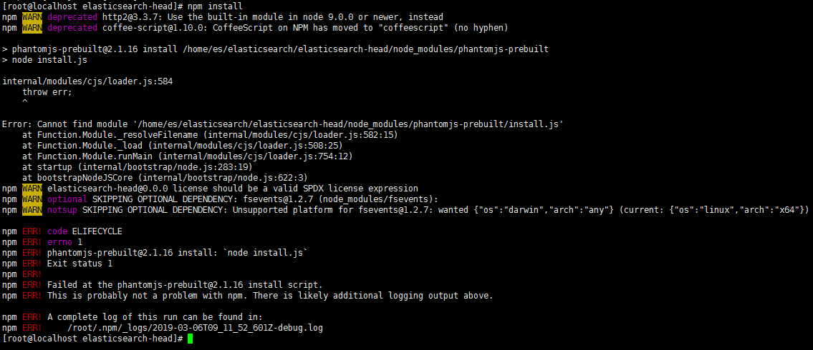

查询资料可知：由于权限问题，当前用户为root。而实际管理elasticsearch服务的用户为es。

```bash
# 将head目录的所有者改为es
cd /home/es/elasticsearch/
chown -R es:es elasticsearch-head/
cd elasticsearch-head/
# 切换当前用户为es
su es
# 再安装依赖包，由于此依赖包过大，选择从阿里云镜像拉取依赖包，能明显加快依赖包的下载速度
npm install --registry=https://registry.npm.taobao.org
# 添加head相关的配置文件如下：
cd /home/es/elasticsearch/elasticsearch-6.3.2/config/
vim elasticsearch.yml
# 自定义配置如下：
#
# 集群名称
cluster.name: elasticsearch
# 当前节点名称
node.name: node-1
# 设置任何人都能够访问
network.host: 0.0.0.0
# 默认就是该配置，设置http端口为9200
http.port: 9200 
# 集群发现
#集群节点ip或者主机(这里的数组元素就是该集群中各节点的ip)
discovery.zen.ping.unicast.hosts: ["192.168.139.149", "192.168.139.150","192.168.139.151"]     
#设置这个参数来保证集群中的节点可以知道其它N个有master资格的节点。默认为1。这里不宜设置过大。测试表示这里设置为2时，只有当前集群中活跃的节点不小于2个，head插件才能监测集群的状态（否则连接不到集群）。
discovery.zen.minimum_master_nodes: 2
# 提供向外交互的tcp端口
transport.tcp.port: 9300
# head插件相关的配置
http.cors.enabled: true
http.cors.allow-origin: "*"
```

配置完成后，执行如下命令:

```bash
# 关闭当前虚拟机的防火墙
su root
systemctl stop firewalld
systemctl disable firewalld
# 切换当前用户为es
su es
cd /home/es/elasticsearch/
# 后台启动elasticsearch服务
./elasticsearch-6.3.2/bin/elasticsearch -d
cd elasticsearch-head/
# 启动head插件
grunt server
```
在本地电脑浏览器中访问该虚拟机的9100端口，出现如下图所示：

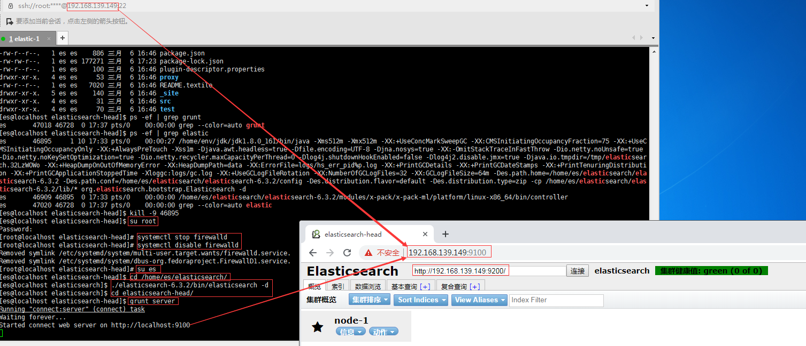

则说明当前单节点elasticsearch服务后台启动，且head插件已经安装成功。

端口解释：`9200端口`是elasticsearch集群提供访问的http端口。`9300端口`是elasticsearch集群提供访问的tcp端口。只要集群处于正常状态，以相应协议连接集群中任何一个存活节点的对应端口即可使用该集群提供的服务。`9100端口`是head插件提供服务的http端口。

其他节点的配置基本完全一致。必须要确保的是`cluster.name`要一致，且`node.name`要不一样。

这里的集群名称是`elasticsearch`，节点名称是`node-1`。因此需要把另外两个节点定义不同的名称，这里就是简单地定义为：`node-2`，`node-3`。

> 在`VMWare Workstation`中，我们只需要完整地配置一个虚拟机即可。另外两个虚拟机可以利用其克隆的功能，直接配置好两个虚拟机。此时只需要修改另外两个虚拟机的`elasticsearch.yml`文件的`node.name`即可。

启动3个节点，预先在命令行工具中使用`curl命令`放入一些`文档`到该集群中，`文档`信息如下：

```bash
curl -XPUT 'localhost:9200/twitter/_doc/1?pretty' -H 'Content-Type: application/json' -d '
{
    "user": "kimchy",
    "post_date": "2009-11-15T13:12:00",
    "message": "Trying out Elasticsearch, so far so good?"
}'

curl -XPUT 'localhost:9200/twitter/_doc/2?pretty' -H 'Content-Type: application/json' -d '
{
    "user": "kimchy",
    "post_date": "2009-11-15T14:12:12",
    "message": "Another tweet, will it be indexed?"
}'

curl -XPUT 'localhost:9200/twitter/_doc/3?pretty' -H 'Content-Type: application/json' -d '
{
    "user": "elastic",
    "post_date": "2010-01-15T01:46:38",
    "message": "Building the site, should be kewl"
}'
```

从head插件查看集群信息如下：


我们这里放了3个`文档`到该集群中，从“集群预览”中可以看出，该机器有10分片（5主5复制）并且主分片的复制分片必定是别的节点之上。

当通过`kill -9 $pid`停掉`node-2`节点的`elasticsearch`后，集群状态立马变成如下：

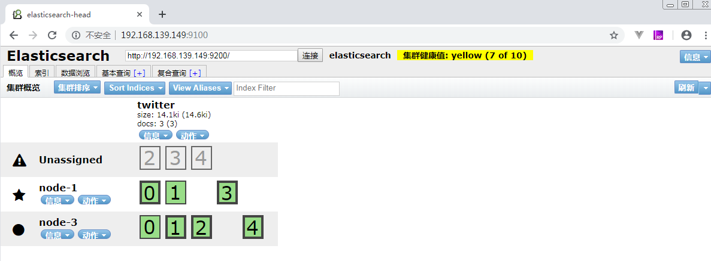

过一段时间之后，集群状态又自动变成如下：

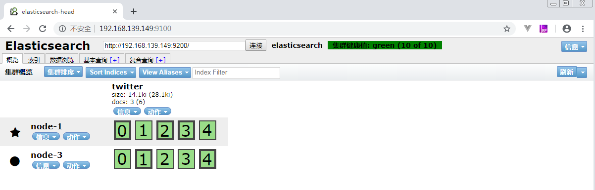

我们可以通过多次重启某个节点的`elasticsearch`服务，会发现：节点的分配规则是elasticsearch帮我们订好了的。<font color="red">只要保证当前集群至少有两个节点，`elasticsearch`中都会保证每个`索引`有10`分片`（5主5从），并且主从分片不在一个节点之上。</font>
这种做法，使得我们不需要关注`elasticsearch`集群中某一个节点宕机是否会导致丢失数据。实际只要当前集群至少有两个节点，一定能够保证该集群的数据安全即`elasticsearch的高可用`。

> 我们也可以通过`nohup grunt server &`命令，将`grunt构建`变为Linux系统的一个服务。这样关闭了当前命令行工具，只有虚拟机不关机，我们就可以通过`9100端口`使用该虚拟机的head可视化插件了。当要关闭服务时，可以通过`ps -ef | grep grunt`以及`ps -ef | grep elastic`查到对应服务的进程号后，通过`kill -9 $pid`的方式杀死对应进程即可停掉服务。

### 中文ik分词器

讨论分词器之前，我们先要知道<font color="red">ElasticSearch具体是如何实现全文检索功能的呢?</font>

我先说一说自己的见解，这样应该对`如何选用合适的分词器`有一定的帮助。

ElasticSearch的全文检索，可以简单分为两项：存储优化分词和检索优化分词。<br/>存储优化分词，就是将ElasticSearch文档中字段值按照一定的切分规则分为多个待匹配靶点，只有搜索关键词命中其中的靶点才会将该字段值对应的文档放在返回结果中。<br/>
检索优化分词，就是将用户输入的搜索关键词按照一定的切分规则分为多个靶点，然后根据这些靶点去匹配ElasticSearch中的所有待匹配靶点。根据这些靶点的匹配程度，ElasticSearch会计算得分，根据匹配度即得分情况从高到底返回搜索结果。如果一个靶点都没有匹配上，得分为0即不返回任何结果。

具体的思路如下图所示：

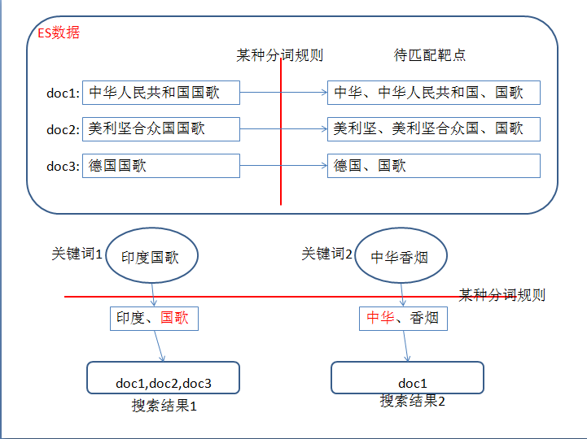

选用不同的分词器，就是选用不同的分词规则。然后我们先试试`elasticsearch`默认分词器的效果怎么样，我们就知道为什么需要安装`ik分词器`了。

我们再在命令行工具中通过curl命令放入一条测试数据，并测试分词效果的命令如下：

```bash
# 放入中文内容
curl -XPUT 'localhost:9200/twitter/_doc/4?pretty' -H 'Content-Type: application/json' -d '
{
    "user": "测试",
    "post_date": "2019-03-07T10:31:00",
    "message": "中华人民共和国国歌"
}'

# 测试默认中文分词器效果
curl -XGET 'localhost:9200/twitter/_doc/4/_termvectors?fields=message&pretty'
# 测试默认英文分词器效果
curl -XGET 'localhost:9200/twitter/_doc/1/_termvectors?fields=message&pretty'
```

分词器效果如下图所示：

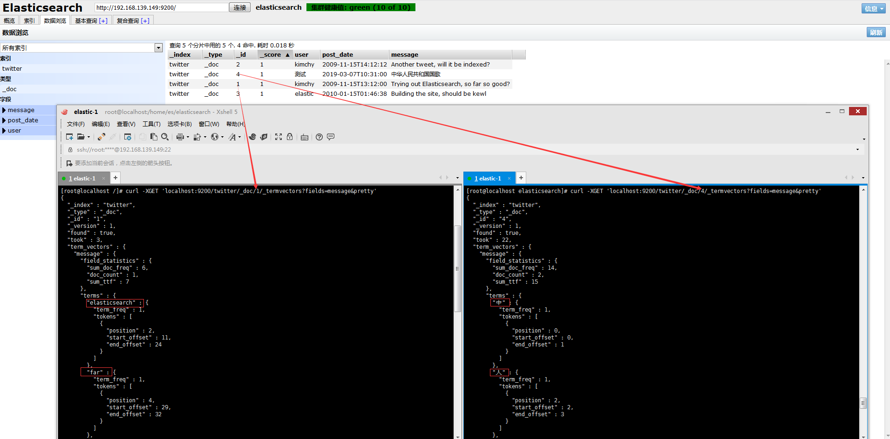

从这里的分词效果来看：所有的英文以及中文单词都分成了单个。对于英文单词这样划分，我们可以接受，但中文的分词效果我们实在难以忍受。这里我们就考虑到要采用中文ik分词器。

IK分词器的版本必须与ES的版本相对应，具体详情参见[IK分词器README](https://github.com/medcl/elasticsearch-analysis-ik)。本篇博客的ES版本为`6.3.2`，因此我们需要到[ik分词器版本记录](https://github.com/medcl/elasticsearch-analysis-ik/releases?after=v6.4.1)中去下载该版本的ik分词器压缩包。

```bash
su root
cd /home/es/elasticsearch/elasticsearch-6.3.2/plugins
# ik分词器应该放在plugins目录下，这里为了方便管理，将其放在plugins/ik下面
mkdir ik
cd ik
# 将下载好的ik压缩包传输到该目录后，解压
unzip elasticsearch-analysis-ik-6.3.2.zip
# 将文件所有者改为es
cd /home/es/elasticsearch/elasticsearch-6.3.2/plugins
chown -R es:es ik/
# 重新启动elaticsearch服务
ps -ef | grep grunt
kill -9 $pid
ps -ef | grep elastic
kill -9 $pid
su es
cd /home/es/elasticsearch/
./elasticsearch-6.3.2/bin/elasticsearch -d
cd elasticsearch-head/
nohup grunt server &
```

> 要保证elasticsearch集群的中文分词能达到预期效果，所有的节点都必须要安装ik分词器并重启elasticsearch服务。如果该集群中某一个存活状态的节点没有安装ik分词器，可能会报错如下：`analyzer [ik_max_word] not found for field[]`。同时要注意，由于elasticsearch的索引中具体字段一旦存放了文档，就不能再更改字段的结构（即无法通过_mapping更改字段的分词规则）。

```bash
# 添加索引index
curl -XPUT "localhost:9200/index"

#通过_mapping设置字段content的分词规则为细粒度分词，字段message的分词规则为粗粒度分词
curl -XPOST "localhost:9200/index/text/_mapping" -H 'Content-Type:application/json' -d'
{
    "properties": {
        "content": {
            "type": "text",
            "analyzer": "ik_max_word",
            "search_analyzer": "ik_max_word"
        },
        "message": {
            "type": "text",
            "analyzer": "ik_smart",
            "search_analyzer": "ik_smart"
        }
    }

}'

# 添加一条测试数据
curl -XPOST "localhost:9200/index/text/1" -H 'Content-Type:application/json' -d'
{
    "content":"中华人民共和国国歌",
    "message":"中华人民共和国国歌"
}
'
# 查看ik_max_word（细粒度）的分词效果
curl -XGET "localhost:9200/index/text/1/_termvectors?fields=content&pretty"
# 查看ik_smart（粗粒度）的分词效果
curl -XGET "localhost:9200/index/text/1/_termvectors?fields=message&pretty"
```

实际的分词效果图如下：

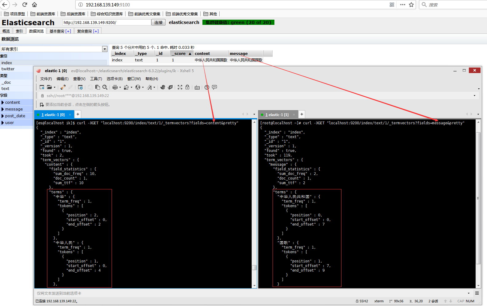

以"中华人民共和国国歌"为例，ik分词的两种分词规则的效果如下：
- `ik_max_word`分词效果："中华"，"中华人民"，"中华人民共和国"，"人民"，"人民共和国"，"共和"，"共和国"，"华人"，"国"，"国歌"。
- `ik_smart`分词效果："中华人民共和国"，"国歌"。

通过`_mapping`设置某个字段的分词规则的命令解释，以设置字段`content`的分词规则语法为例：

```bash
"content": {
    "type": "text",
    "analyzer": "ik_max_word",
    "search_analyzer": "ik_max_word"
}
# content 就是对应的字段名称
# type 的值常用备选项有：text/keyword/integer/float/array/boolean/date等等。text表示该字段会分词即倒排索引；keyword表示该字段不分词（比如邮箱、邮政编码等信息分词没有意义，就需要设置为keyword）。
# analyzer 的值表示存储的数据用哪种规则进行分词。
# search_analyzer 的值表示我们输入的搜索关键词用哪种规则进行分词。

# 只有输入关键词的分词备选项，与最终保存的分词结果索引相匹配，才能检索到。
# 以"中华人民共和国国歌"的`ik_smart`分词效果(message)："中华人民共和国"，"国歌"为例。我们搜索关键词q="中华人民"是查不到这条记录的，我们可以通过以下命令进行测试验证。
curl -XGET 'localhost:9200/index/text/_search' -H 'Content-Type:application/json' -d'
{
    "query": {
        "bool": {
            "must": [
                {
                    "term": {
                        "message": "中华人民"
                    }
                }
            ]
        }
    }
}
'
# 这样是找不到对应的记录的。如果把"message"改为"content"，就可以查到结果的，具体原因参考上面的解释。
```

分词规则对比测试效果如下：

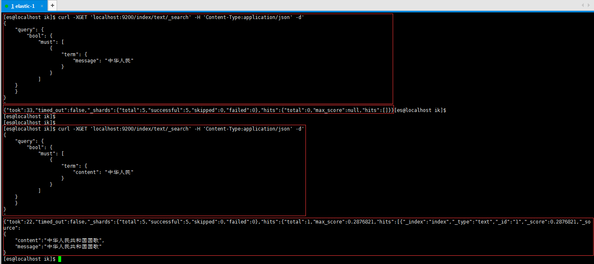

### 拼音分词器

我们在淘宝和京东商城可以通过拼音搜到对应的商品，同样ElasticSearch也有对应的拼音分词器来完成检索功能。

与IK分词器一样，拼音分词器的版本必须与ES的版本相对应，具体详情参见[拼音分词器README](https://github.com/medcl/elasticsearch-analysis-pinyin)。我们需要到[拼音分词器版本记录](https://github.com/medcl/elasticsearch-analysis-pinyin/releases)中去下载对应版本的拼音分词器压缩包。安装过程也类似,同样所有的节点都要安装拼音分词器。命令如下：

```bash
su root
cd /home/es/elasticsearch/elasticsearch-6.3.2/plugins
# 拼音分词器应该放在plugins目录下，这里为了方便管理，将其放在plugins/pinyin下面
mkdir pinyin
cd pinyin
# 将下载好的拼音分词器压缩包传输到该目录后，解压
unzip elasticsearch-analysis-pinyin-6.3.2.zip
# 将文件所有者改为es
cd /home/es/elasticsearch/elasticsearch-6.3.2/plugins
chown -R es:es pinyin/
# 重新启动elaticsearch服务
# ... ... 具体命令参考上面ik分词器的启用
```

安装拼音分词器，并成功启动集群后，测试拼音分词器效果的命令如下：

```bash
# 为索引test1创建一个自定义规则的拼音分词器pinyin_analyzer，具体规则就是my_pinyin中定义的内容。这些字段的含义可参考elasticsearch-analysis-pinyin中REAMDE说明
curl -XPUT "localhost:9200/test1" -H 'Content-Type:application/json' -d'
{
    "index" : {
        "analysis" : {
            "analyzer" : {
                "pinyin_analyzer" : {
                    "tokenizer" : "my_pinyin"
                    }
            },
            "tokenizer" : {
                "my_pinyin" : {
                    "type" : "pinyin",
                    "keep_separate_first_letter" : false,
                    "keep_full_pinyin" : true,
                    "keep_original" : true,
                    "limit_first_letter_length" : 16,
                    "lowercase" : true,
                    "remove_duplicated_term" : true
                }
            }
        }
    }
}
'

# 测试这个自定义分词器pinyin_analyzer的分词效果命令如下：
curl -XGET "localhost:9200/test1/_analyze?pretty" -H 'Content-Type:application/json' -d'
{
    "text": ["刘德华"],
  "analyzer": "pinyin_analyzer"
}
'
```

该自定义拼音分词器的分词效果图如下：

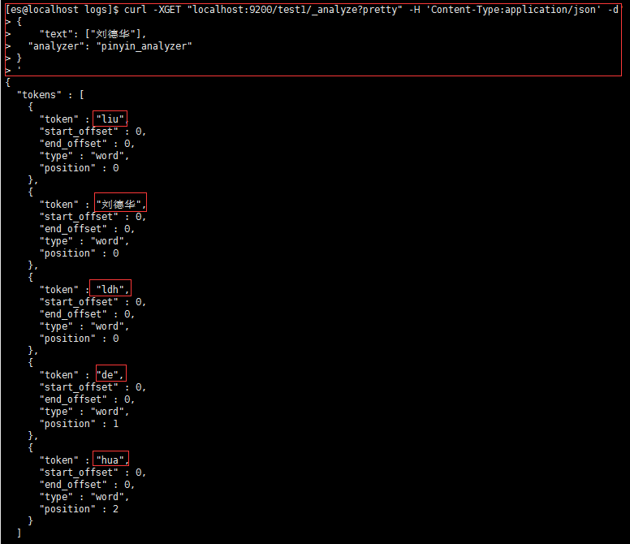

也就是说，经过该分词器分词后，通过"liu","de","hua","ldh","刘德华"能检索到这条记录。

### 繁体字分词器

我们还可能遇到这个问题：就是搜索或者存储的时候，我们用的是繁体字。但搜索结果并不完美。简体字只能搜索到简体字，繁体字只能搜索到繁体字。这里我们希望能够返回所有的结果，就需要使用繁体字分词器。

同样地与IK分词器一样，繁体字分词器的版本必须与ES的版本相对应，具体详情参见[繁体字分词器README](https://github.com/medcl/elasticsearch-analysis-stconvert)。我们需要到[繁体字分词器版本记录](https://github.com/medcl/elasticsearch-analysis-stconvert/releases)中去下载对应版本的繁体字分词器压缩包。安装过程也类似,同样所有的节点都要安装繁体字分词器。命令如下：

```bash
su root
cd /home/es/elasticsearch/elasticsearch-6.3.2/plugins
# 繁体字分词器应该放在plugins目录下，这里为了方便管理，将其放在plugins/stconvert下面
mkdir stconvert
cd stconvert
# 将下载好的繁体字分词器压缩包传输到该目录后，解压
unzip elasticsearch-analysis-stconvert-6.3.2.zip
# 将文件所有者改为es
cd /home/es/elasticsearch/elasticsearch-6.3.2/plugins
chown -R es:es stconvert/
# 重新启动elaticsearch服务
# ... ... 具体命令参考上面ik分词器的启用
```

安装繁体字分词器，并成功启动集群后，测试繁体字分词器效果的命令如下：

```bash

# 为索引test2创建一个自定义分词器（将繁体字转为简体字），默认是s2t(Simple Chinese To Tradional Chinese)即简体字转繁体字
curl -XPUT "localhost:9200/test2" -H 'Content-Type:application/json' -d'
{
    "index" : {
        "analysis" : {
            "analyzer" : {
                "tsconvert" : {
                    "tokenizer" : "tsconvert"
                    }
            },
            "tokenizer" : {
                "tsconvert" : {
                    "type" : "stconvert",
                    "delimiter" : "#",
                    "keep_both" : false,
                    "convert_type" : "t2s"
                }
            },   
             "filter": {
               "tsconvert" : {
                     "type" : "stconvert",
                     "delimiter" : "#",
                     "keep_both" : false,
                     "convert_type" : "t2s"
                 }
             },
            "char_filter" : {
                "tsconvert" : {
                    "type" : "stconvert",
                    "convert_type" : "t2s"
                }
            }
        }
    }
}
'

# 我们应该关注的是字段convert_type的值，备选项只有：s2t和t2s。默认值是s2t。
# 测试分词效果的命令如下：
curl -XGET "localhost:9200/test2/_analyze" -H "Content-Type:Application/json" -d '
{
    "tokenizer" : "keyword",
    "filter" : ["lowercase"],
    "char_filter" : ["tsconvert"],
    "text" : "国际國際"
}
'
```

繁体字转为简体字的测试效果图如下：

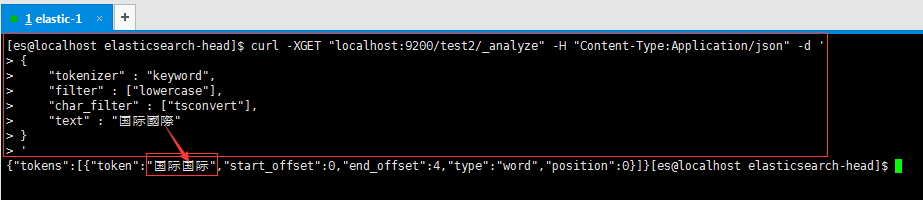

上面提到的IK分词器、拼音分词器、繁体字分词器，我们目前都是只使用其中一个分词器，我们如何组合使用它们呢？也就是说，我们如何通过组合这些分词器来自定义分词规则呢？

即我们需要满足如下需求：
1. <font color="red">搜索关键词为拼音</font>时，能搜索到相关的对应中文文档；
2. <font color="red">搜索关键词为简体字</font>时，能搜索到相关的简体或繁体文档；
3. <font color="red">搜索关键词为繁体字</font>时，也能搜索到相关的简体或繁体文档。

先给出一个解决方案的案例如下：

```bash
# 设置索引goods的settings（该命令会同时创建该索引，如果执行命令之前该索引已创建会报错，因为elasticsearch不支持动态修改主分片的settings）
curl -XPUT "localhost:9200/goods" -H "Content-Type:application/json" -d '
{
    "settings": {
        "index": {
            "analysis": {
                "filter": {
                    "myEdgeNgramFilter": {
                    "type": "edge_ngram",
                    "min_gram": 1,
                    "max_gram": 50
                    },
                    "myPinyinFilter": {
                    "type": "pinyin",
                    "first_letter": "prefix",
                    "padding_char": " ",
                    "limit_first_letter_length": 50,
                    "lowercase": true
                    }
                },
                "char_filter": {
                    "tsconvert": {
                    "type": "stconvert",
                    "convert_type": "t2s"
                    }
                },
                "analyzer": {
                    "myIkAnalyzer": {
                        "type": "custom",
                        "tokenizer": "ik_max_word",
                        "char_filter": [
                            "tsconvert"
                        ]
                    },
                    "myPinyinAnalyzer": {
                        "tokenizer": "keyword",
                        "filter": [
                            "myEdgeNgramFilter",
                            "myPinyinFilter",
                            "lowercase"
                        ]
                    }
                }
            }
        }
    }
}
'

# 设置索引goods的mappings（此时该索引中不能有文档信息。因为当添加文档时如果字段没有设置分词规则，elasticsearch会为这些字段设置默认的分词规则，同时elasticsearch又不支持动态修改字段的分词规则）
curl -XPUT "localhost:9200/goods/goodsInfo/_mapping" -H "Content-Type:application/json" -d '
{
    "properties": {
        "id": {
            "type": "integer"
        },
        "name": {
            "type": "text",
            "analyzer": "myIkAnalyzer",
            "search_analyzer": "myIkAnalyzer",
            "fields": {
                "pinyin": {
                    "type": "text",
                    "analyzer": "myPinyinAnalyzer",
                    "search_analyzer": "myPinyinAnalyzer"
                }
            }
        },
        "brand": {
            "type": "text",
            "index": "true",
            "analyzer": "myIkAnalyzer"
        },
        "date": {
            "type": "date",
            "format": "yyyy-MM-dd HH:mm:ss||yyyy-MM-dd||epoch_millis"
        }
    }
}
'

# 添加测试数据
curl -XPOST "localhost:9200/goods/goodsInfo/1" -H "Content-Type:application/json" -d '
{
    "id": 1,
    "name": "智能機器人",
    "brand": "小米",
    "date": "2019-03-08"
}'
curl -XPOST "localhost:9200/goods/goodsInfo/2" -H "Content-Type:application/json" -d '
{
    "id": 2,
    "name": "智能牙刷",
    "brand": "小米",
    "date": "2019-03-08"
}'
curl -XPOST "localhost:9200/goods/goodsInfo/3" -H "Content-Type:application/json" -d '
{
    "id": 3,
    "name": "測試機器",
    "brand": "測試",
    "date": "2019-03-08"
}'
curl -XPOST "localhost:9200/goods/goodsInfo/4" -H "Content-Type:application/json" -d '
{
    "id": 4,
    "name": "测试电脑",
    "brand": "测试",
    "date": "2019-03-08"
}'
curl -XPOST "localhost:9200/goods/goodsInfo/5" -H "Content-Type:application/json" -d '
{
    "id": 5,
    "name": "杯子",
    "brand": "测试",
    "date": "2019-03-08"
}'


# 测试查询的命令如下：($keywords为我们输入的搜索关键词，我们可以多次改变搜索关键词看检索结果)
curl -XGET 'localhost:9200/goods/goodsInfo/_search' -H 'Content-Type:application/json' -d '
{
    "query": {
        "bool": {
            "should": [
                {
                    "match": {
                        "name.pinyin": "$keywords"
                    }
                },
                {
                    "multi_match": {
                        "query": "$keywords",
                        "fields": ["name^3", "brand"]
                    }
                }
                
            ] 
        }
    }
}'
```

以`keywords = ceshi`和`keywords = 测试`的搜索效果图如下:

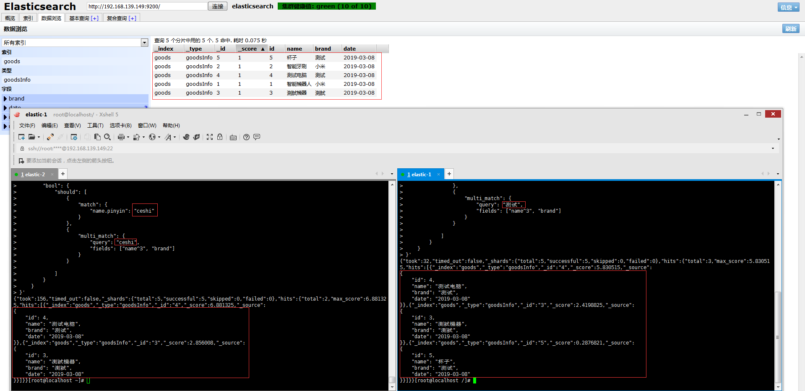

案例说明：
- `settings`中预先为索引`goods`定义了两个分词器`myIkAnalyzer`和`myPinyinAnalyzer`。`myIkAnalyzer`的分词规则是：先将字段值全部转化为简体中文，然后以最细粒度`ik_max_word`进行分词；`myPinyinAnalyzer`的分词规则是：先将字段的拼音值进行补全`edge_ngram`，然后将拼音都转化为小写并参照拼音分词器`pinyin`的规则进行分词。
- `mappings`中为索引`goods`中字段`name`指定了分词规则`myIkAnalyzer`，`name.pinyin`指定了分词规则`myPinyinAnalyzer`；为字段`brand`指定了分词规则`myIkAnalyzer`。
- 按用户输入的搜索关键词`keywords`去检索时，会分别按字段`brand`，`name和name.pinyin`的分词规则去匹配结果。同时为字段`name`设置了权重`3`，这样检索返回结果排序主要依赖这个字段的匹配程度。

## `Springboot`整合`ElasticSearch`

1. 在项目`pom`文件中导入依赖包并指定`elasticsearch`的版本，SpringBoot和ElasticSearch可能会有版本冲突问题，具体SpingBoot和ElasticSearch版本选用请参考[spring-data-elasticsearch源码README](https://github.com/spring-projects/spring-data-elasticsearch)，
如：由于我的`elasticsearch`版本为`6.3.2`，因此`我的spring-data-elasticsearch`版本为`3.1.5`。

```xml
 <?xml version="1.0" encoding="UTF-8"?>
 <project>
    <parent>
        <groupId>org.springframework.boot</groupId>
        <artifactId>spring-boot-starter-parent</artifactId>
        <version>2.1.3.RELEASE</version>
        <relativePath/> <!-- lookup parent from repository -->
    </parent>
    <properties>
        <java.version>1.8</java.version>
        <elasticsearch.version>6.3.2</elasticsearch.version>
    </properties>
    <dependencies>
        <dependency>
            <groupId>org.springframework.boot</groupId>
            <artifactId>spring-boot-starter-data-elasticsearch</artifactId>
        </dependency>
    </dependencies>   
 </project>
```

2. 解决`redis`与`elasticsearch`自动配置导致的`netty`版本冲突，定义如下类：

```java
@Slf4j
@Component
public class ElasticSearchConfig implements InitializingBean {

    static {
        System.setProperty("es.set.netty.runtime.available.processors", "false");
    }

    @Override
    public void afterPropertiesSet() throws Exception {
        log.info("解决由于netty版本冲突导致项目无法启动");
        log.info("设置es.set.netty.runtime.available.processors的值为：[{}]",System.getProperty("es.set.netty.runtime.available.processors"));
    }
}

```

3. 在`application.yml`配置文章中必须要指定`elasticsearch集群`以及`当前存活的任意一个节点的9300端口`。

```yml
spring:
    data:
        elasticsearch:
            cluster-name: elasticsearch
            cluster-nodes: 192.168.139.149:9300
```

4. 在实体类`Goods`中定义索引、类型以及字段的分词规则。如果只是简单地使用某一个分词器或使用默认分词器，可以用`spring-data-elasticsearch`提供的`@Field`注解来定义字段的分词规则。如果分词规则需要自定义，则可使用`@Setting`和`@Mapping`来自定义分词器以及具体字段的分词规则。

```java
@Getter
@Setter
@ToString
@Document(indexName = "goods", type = "goodsInfo")
@Setting(settingPath = "json/goods_setting.json")
@Mapping(mappingPath = "json/goods_mapping.json")
public class Goods {

    @Id
    private Integer id;
//    @Field(type = FieldType.Text, analyzer = "ik_max_word", searchAnalyzer = "ik_max_word")
    private String name;
    private String brand;
    private Date date;

}
 ```

`Goods`实体类中指定的`goods_setting.json`如下：

```json
{
    "index": {
        "analysis": {
            "filter": {
                "myEdgeNgramFilter": {
                    "type": "edge_ngram",
                    "min_gram": 1,
                    "max_gram": 50
                },
                "myPinyinFilter": {
                    "type": "pinyin",
                    "first_letter": "prefix",
                    "padding_char": " ",
                    "limit_first_letter_length": 50,
                    "lowercase": true
                }
            },
            "char_filter": {
                "tsconvert": {
                    "type": "stconvert",
                    "convert_type": "t2s"
                }
            },
            "analyzer": {
                "myIkAnalyzer": {
                    "type": "custom",
                    "tokenizer": "ik_max_word",
                    "char_filter": [
                        "tsconvert"
                    ]
                },
                "myPinyinAnalyzer": {
                    "tokenizer": "keyword",
                    "filter": [
                        "myEdgeNgramFilter",
                        "myPinyinFilter",
                        "lowercase"
                    ]
                }
            }
        }
    }
}
```

`Goods`实体类中指定的`goods_mapping.json`如下：

```json
{
    "goodsInfo": {
        "id": {
            "type": "integer"
        },
        "name": {
            "type": "text",
            "analyzer": "myIkAnalyzer",
            "search_analyzer": "myIkAnalyzer",
            "fields": {
                "pinyin": {
                    "type": "text",
                    "analyzer": "myPinyinAnalyzer",
                    "search_analyzer": "myPinyinAnalyzer"
                }
            }
        },
        "brand": {
            "type": "text",
            "index": "true",
            "analyzer": "myIkAnalyzer"
        },
        "date": {
            "type": "date",
            "format": "yyyy-MM-dd HH:mm:ss||yyyy-MM-dd||epoch_millis"
        }
    }
}
```

5. 定义`Goods`的数据访问接口`GoodsRepository`，由于该接口继承了`ElasticsearchRepository`，我们可以使用`ElasticsearchRepository`默认提供的很多方法，也可以根据自己的需求来自定义方法。

```java
@Repository
public interface GoodsRepository extends ElasticsearchRepository<Goods, Integer> {
}
```

5. 测试类`ElasticSearchTest`如下：

```java
/**
 * @author zhenye 2019/3/11
 */
@RunWith(SpringRunner.class)
@SpringBootTest
@Slf4j
public class ElasticSearchTest {

    @Autowired
    private ElasticsearchTemplate template;
    @Autowired
    private GoodsRepository goodsRepository;

    @Test
    public void addIndexTest() {
        // 创建索引(json/goods_setting.json中的设置开始生效)
        template.createIndex(Goods.class);
        // 设置索引对应字段的分词规则(json/goods_mapping.json中的设置开始生效)
        template.putMapping(Goods.class);
    }

    @Test
    public void deleteIndexTest () {
        // 删除索引
        template.deleteIndex(Goods.class);
    }

    @Test
    public void addDataTest() {
        // 添加一些测试数据
        List<Goods> goodsList = new ArrayList<>();
        Goods goods1 = new Goods(1,"智能機器人","小米", new Date());
        Goods goods2 = new Goods(2,"智能牙刷","小米", new Date());
        Goods goods3 = new Goods(3,"測試機器","測試", new Date());
        Goods goods4 = new Goods(4,"测试电脑","测试", new Date());
        Goods goods5 = new Goods(5,"杯子","测试", new Date());
        goodsList.add(goods1);
        goodsList.add(goods2);
        goodsList.add(goods3);
        goodsList.add(goods4);
        goodsList.add(goods5);
        goodsRepository.saveAll(goodsList);
    }

    @Test
    public void simpleSearchTest() {
        // 进行一些简单搜索的测试
        Iterable<Goods> allGoods = goodsRepository.findAll();
        allGoods.forEach(goods -> log.info(goods.toString()));

        String name = "测试";
        /*
         * 这里的`findByName`我们不能简单得理解为“精确搜索”或“模糊搜索”。
         * 返回的结果依赖于存储和搜索时各自采用的分词规则。
         * 根据goods_mapping.json中name的设置可知，存储和检索都是ik_max_word。
         * 因此，这里`findByName("测试")`，就是找  字段值的分词后有"测试"  的文档。
         */
        List<Goods> goodsByName = goodsRepository.findByName(name);
        log.info(goodsByName.toString());
    }

    @Test
    public void complexSearchTest() {
        // ElasticsearchRepository接口中，还有一个search()方法，允许我们灵活组装搜索条件
        /*
         * 以下面一个需求为例：
         * 1. 检索的goods中的name和brand字段，排序结果主要依赖name的匹配度
         * 2. 匹配brand时，支持简体/繁体关键字匹配
         * 3. 匹配name时，支持简体/繁体/中文拼音等关键字匹配
         */

//        String keywords = "";
//        String keywords = "測試哈哈哈 啦啦啦";
        String keywords = "ceshi";
//        String keywords = "测试";
        DisMaxQueryBuilder disMaxQueryBuilder = QueryBuilders.disMaxQuery();
        QueryBuilder queryBuilder1 = QueryBuilders.matchQuery("name", keywords).boost(2f);
        QueryBuilder queryBuilder2 = QueryBuilders.matchQuery("name.pinyin", keywords).boost(0.5f);
        disMaxQueryBuilder.add(queryBuilder1);
        disMaxQueryBuilder.add(queryBuilder2);
        SearchQuery searchQuery = new NativeSearchQuery(disMaxQueryBuilder);
        Page<Goods> goodsPage = goodsRepository.search(searchQuery);
        System.out.println("keywords = ["+ keywords + "]的检索结果为：" + goodsPage.getContent());
    }
}
```

复杂搜索的效果图如下：

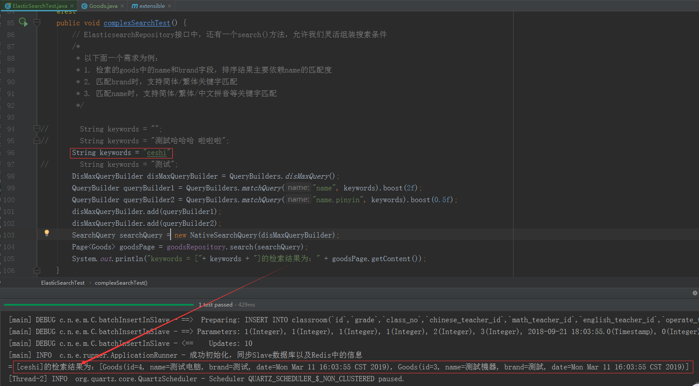

 ## 注意事项

 1. 由于`ElasticSearch`的版本迭代分词快，版本之间差异较大。因此确定好使用的`ElasticSearch`版本后，其插件（如分词器）和SpringBoot都应该与其对应。
 2. 在服务器上是无法以`root`用户使用`ElasticSearch`服务的。以`es`用户启动服务时，需要将ElasticSearch及其插件所在目录的所有人也改为`es`，否则项目无法启动。
 3. 以集群方式启动`ElasticSearch`服务，并设置了最小主节点数`discovery.zen.minimum_master_nodes: 2`时，必须要保证当前存活的节点大于该设置值，否则head插件无法访问该集群。
 4. 如果web项目中同时会使用`redis`和`elasticsearch`，使用springboot的自动配置可能会报错`nested exception is java.lang.IllegalStateException: availableProcessors is already set to [4], rejecting [4]`。这实际上是使用的netty版本冲突，我们需要在项目启动前加入如下代码进行配置`System.setProperty("es.set.netty.runtime.available.processors", "false");`.
 5. 我们使用`GoodsRepository`的自定义方法进行检索数据时，里面的过滤条件`By...`以及`By...Like`等关键字结果可能不太符合预期效果。因为`ElasticSearch`为了提高检索效率，对字段存储值以及搜索关键词进行了分词，具体的查询效果是依赖于存储值以及搜索关键词的分词效果的。